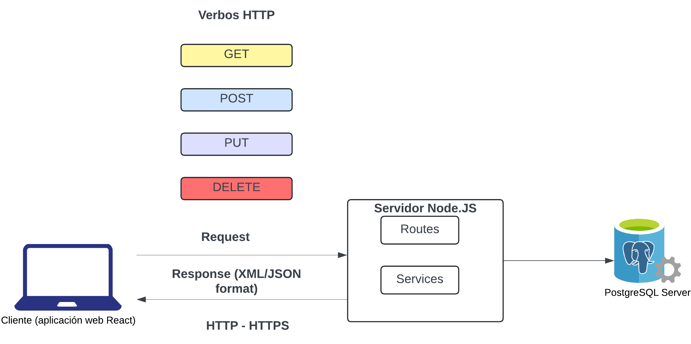

# Conexión de una base de datos con una aplicación

Existen diversas formas de conectar una base de datos a una aplicación, y la elección depende del lenguaje de programación, el sistema de gestión de bases de datos (DBMS) y las necesidades específicas del proyecto. Aunque no existe un único estándar, hay métodos ampliamente aceptados y utilizados en la industria.

## Métodos Comunes para Conectar una Base de Datos

1. **Drivers Nativos**  
   Cada DBMS (como PostgreSQL, MySQL, SQL Server, Oracle) ofrece un driver nativo que permite a la aplicación conectarse directamente.  
   - Ejemplo: Para PostgreSQL se utiliza el módulo [pg](https://github.com/brianc/node-postgres/tree/master/packages/pg) en Node.js que es basado en [libpq](https://www.postgresql.org/docs/9.5/libpq.html).

2. **ODBC y JDBC**  
   - **ODBC (Open Database Connectivity):** Un estándar que permite conectarse a diferentes bases de datos de forma uniforme.  
   - **JDBC (Java Database Connectivity):** La versión de ODBC para Java, ampliamente utilizada en aplicaciones Java.

3. **ORMs (Object-Relational Mappers)**  
   Los ORMs facilitan la interacción entre la aplicación y la base de datos al mapear tablas a objetos.  
   - Ejemplos: Sequelize (Node.js), Hibernate (Java), Entity Framework (.NET), Django ORM (Python).

4. **APIs y Microservicios**  
   En arquitecturas modernas, se suelen usar APIs RESTful o microservicios para gestionar la comunicación con la base de datos, lo que permite separar la lógica de negocio del acceso a datos.

5. **Conexión Directa mediante Bibliotecas del Lenguaje**  
   Muchos lenguajes de programación proporcionan bibliotecas específicas para conectarse a bases de datos.  
   - Ejemplos:  
     - Node.js: módulos como `pg` para PostgreSQL o `mysql2` para MySQL.  
     - Python: bibliotecas como `psycopg2` para PostgreSQL o `mysql-connector-python` para MySQL.

## ¿Existe un Estándar?

Aunque no hay un único estándar universal para conectar una base de datos a una aplicación, **ODBC** y **JDBC** son protocolos muy extendidos y aceptados. Además, los drivers nativos y ORMs siguen convenciones que aseguran compatibilidad y buen rendimiento, adaptándose a las particularidades de cada DBMS y lenguaje.

---

# Conexión de Bases de Datos en Lenguajes Tradicionales vs. Lenguajes Modernos

Los lenguajes como **C#** y **Java** suelen requerir drivers estandarizados (como **ODBC** o **JDBC**) para conectarse a bases de datos, mientras que lenguajes modernos como **Node.js** utilizan librerías específicas (por ejemplo, **pg** para PostgreSQL). Esto se debe a varias razones:

- **Estandarización e Interoperabilidad:**  
  Los drivers ODBC y JDBC proporcionan una interfaz común que permite a una aplicación conectarse a distintos sistemas de gestión de bases de datos sin necesidad de reescribir el código para cada uno.

- **Sistemas Fuertemente Tipados y Compilados:**  
  C# y Java son lenguajes fuertemente tipados y compilados, lo que hace necesario contar con una interfaz estandarizada que garantice la integridad y portabilidad en el acceso a datos.

- **Evolución Histórica:**  
  Estos lenguajes fueron desarrollados en una época en la que la solución más robusta para interactuar con múltiples DBMS era utilizar drivers estandarizados, asegurando así la compatibilidad y el mantenimiento a largo plazo.

Por otro lado, **Node.js** se desarrolló en una era moderna en la que es posible crear librerías nativas optimizadas para cada DBMS. Así:

- **Integración Específica y Optimizada:**  
  Librerías como **pg** están diseñadas exclusivamente para PostgreSQL, aprovechando sus características y optimizando el rendimiento sin la capa adicional que implican los drivers estandarizados.

- **Simplicidad y Flexibilidad:**  
  Estas librerías ofrecen APIs sencillas y bien documentadas, facilitando la conexión, manejo de consultas y gestión de errores, lo que simplifica el desarrollo de aplicaciones sin necesidad de un driver estandarizado.

En resumen:
- **Lenguajes tradicionales (C#, Java):** Utilizan drivers estandarizados (ODBC/JDBC) para asegurar la interoperabilidad y consistencia entre distintos sistemas.
- **Lenguajes modernos (Node.js):** Emplean librerías específicas (como **pg**) que proporcionan una integración más directa y eficiente con el DBMS, adaptándose mejor a las necesidades de desarrollo actuales.

---

# Ejemplo de conexión ODBC con Python usando pyodbc

A continuación, se muestra un ejemplo básico de cómo conectar una aplicación en Python a una base de datos PostgreSQL mediante ODBC, utilizando la librería **pyodbc**.

**Requisitos:**
- Tener instalado el driver ODBC para PostgreSQL (por ejemplo, "PostgreSQL Unicode").
  - Documentación para instalación y configuración del driver en los Sistemas Operativos:
    - [Mac](https://www.boriel.com/postgresql-odbc-connection-from-mac-os-x.html)
    - [Windows](https://odbc.postgresql.org/docs/win32-compilation.html)
    - [Unix](https://odbc.postgresql.org/docs/unix-compilation.html)
- Instalar la librería pyodbc en Python (puedes instalarla con `pip install pyodbc`).

> Para Mac, también tuve que instalar la siguiente librería:
```
python3 ejemplos/python-odbc.py 
```

**Código de ejemplo:**

Disponible [aquí](ejemplos%2FConexion%20DB%20Con%20App%2Fpython-odbc.py).

```python
import pyodbc
```

# Configurar la cadena de conexión ODBC
```python
conn_str = (
    "DRIVER={PostgreSQL Unicode};"
    "SERVER=localhost;"
    "PORT=5432;"  # Asegúrate de usar el puerto correcto (por ejemplo, 5432 o 5433)
    "DATABASE=pagila;"
    "UID=postgres;"
    "PWD=yourpassword;"
)
```

# Establecer la conexión
```python
conn = pyodbc.connect(conn_str)
```

# Crear un cursor para ejecutar consultas
```python
cursor = conn.cursor()
```

# Ejecutar una consulta simple: obtener los títulos de las primeras 5 películas
```python
cursor.execute("SELECT title FROM film LIMIT 5")
```

# Imprimir los resultados
```python
for row in cursor.fetchall():
    print(row.title)
```

# Cerrar la conexión
```python
conn.close()
```
**Explicación:**
1. Se configura la cadena de conexión (`conn_str`) con el driver, servidor, puerto, nombre de la base de datos, usuario y contraseña.
2. Se establece la conexión a la base de datos mediante `pyodbc.connect()`.
3. Se crea un cursor para ejecutar la consulta SQL.
4. Se ejecuta una consulta simple para seleccionar los títulos de 5 películas.
5. Se recorren e imprimen los resultados.
6. Finalmente, se cierra la conexión a la base de datos.

Este ejemplo demuestra cómo utilizar ODBC para conectarse a PostgreSQL en una aplicación Python. Puedes adaptar el código para conectarte a otros DBMS cambiando la cadena de conexión y utilizando el driver adecuado.

---

## Aplicación de ejemplo para practicar el uso de `pg` en Node.js

En este proyecto, desarrollaremos una aplicación web sencilla pero poderosa que permitirá a los profesores crear, administrar y calificar parciales en línea. La aplicación estará orientada a facilitar la creación de pruebas para evaluar el conocimiento de los estudiantes en diversas áreas temáticas. Los estudiantes, por su parte, podrán acceder a los parciales, responder a las preguntas y ver sus resultados de manera eficiente.

### Funcionalidades principales:
1. Para el Profesor:
  - Crear parciales: Los profesores podrán crear parciales personalizados con preguntas de tres tipos:
    - Preguntas abiertas: Los estudiantes escribirán una respuesta en formato libre.
    - Selección múltiple con única respuesta: Los estudiantes elegirán una sola opción correcta.
    - Selección múltiple con respuestas múltiples: Los estudiantes podrán seleccionar varias opciones correctas.
  - Gestionar parciales: Los profesores podrán actualizar o eliminar parciales según sea necesario.
  - Ver respuestas de los estudiantes: Una vez que los estudiantes hayan completado un parcial, los profesores podrán visualizar las respuestas de cada estudiante y corregir las respuestas automáticamente.

2. Para el Estudiante:
  - Registrarse y obtener un código único: Los estudiantes se registrarán con sus datos y recibirán un código único para contestar el parcial.
  - Contestar el parcial: Los estudiantes podrán responder las preguntas de un parcial de manera rápida y sencilla, pero solo podrán contestarlo una vez.
  - Ver sus respuestas: Después de contestar el parcial, los estudiantes podrán ver sus respuestas y la corrección automática de las mismas.

### Objetivos del proyecto:
- Desarrollo de la interfaz de usuario: Crear una interfaz intuitiva y amigable utilizando tecnologías como React y Material UI para la parte visual.
- Gestión de datos: Implementar una base de datos en PostgreSQL para almacenar usuarios, parciales, preguntas, respuestas y resultados.
- Autenticación y autorización: Usar mecanismos de autenticación para garantizar que solo el profesor pueda crear y ver parciales, mientras que los estudiantes solo puedan contestarlos.

### Tecnologías principales:
- Frontend: React.js, Material UI.
- Backend: Express.js con Node.js.
- Base de Datos: PostgreSQL para almacenar los datos de los usuarios, preguntas y respuestas.
- Autenticación: Gestión de usuarios con autenticación de profesores y estudiantes.

### Pre-requisitos-
- Tener instalado Node.js. Puede seguir los pasos en este [link](https://nodejs.org/en/download) para descargar e instalar Node.js en su sistema operativo.

### Recursos útiles
- Mejores prácticas para diseño de aplicaciones REST. [Link](https://dilankam.medium.com/restful-api-design-best-practices-principles-ded471f573f3).
- Crear una aplicación con Node.js y PostgreSQL. [Link](https://medium.com/dailyjs/node-js-postgresql-tutorial-7a19d945767f)
- Mejores prácticas de Node.js en español. [Link](https://github.com/goldbergyoni/nodebestpractices/blob/spanish-translation/README.spanish.md)

### Diagrama de alto nivel


### Rutas en Express.js
#### Rutas de Parciales (profesores únicamente):

- Crear Parcial:</br>
`POST /parciales`: Permite al profesor crear un nuevo parcial con las preguntas.
- Actualizar Parcial:</br>
`PUT /parciales/:id`: Permite al profesor actualizar un parcial existente.
- Borrar Parcial:</br>
`DELETE /parciales/:id`: Permite al profesor borrar un parcial.
- Ver respuestas de los estudiantes:</br>
`GET /parciales/:id/respuestas`: Muestra las respuestas de los estudiantes para un parcial específico.

#### Rutas de Estudiantes:

- Registrar Estudiante:</br>
`POST /estudiante`: Permite a un estudiante registrarse con su nombre y correo electrónico, generando un código único.
- Contestar Parcial:</br>
`POST /estudiante/:id/parcial`: Permite al estudiante responder un parcial usando el código único generado.
- Ver Respuestas:</br>
`GET /estudiante/:id/respuestas`: Muestra las respuestas de un estudiante para un parcial.

---

## Conclusión

La forma de conectar una base de datos a una aplicación dependerá de:
- El **lenguaje de programación** y las herramientas disponibles.
- Las **características del DBMS** (por ejemplo, PostgreSQL, MySQL, etc.).
- Los **requisitos del proyecto** en términos de rendimiento, seguridad y escalabilidad.

Elegir el método adecuado te permitirá desarrollar aplicaciones robustas y eficientes, aprovechando al máximo las capacidades de tu base de datos.


