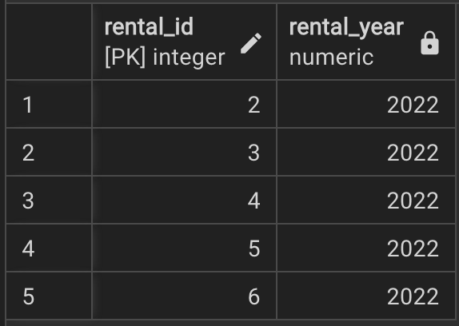
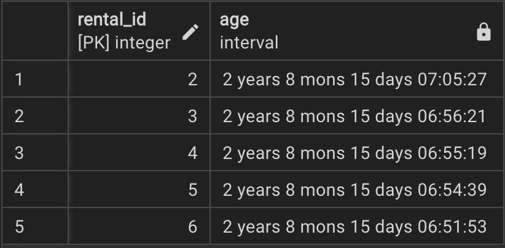
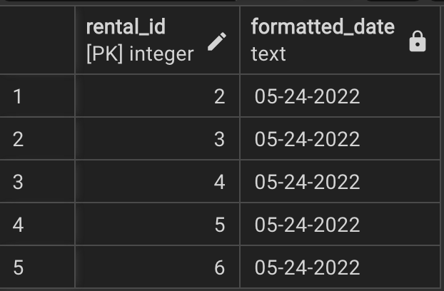
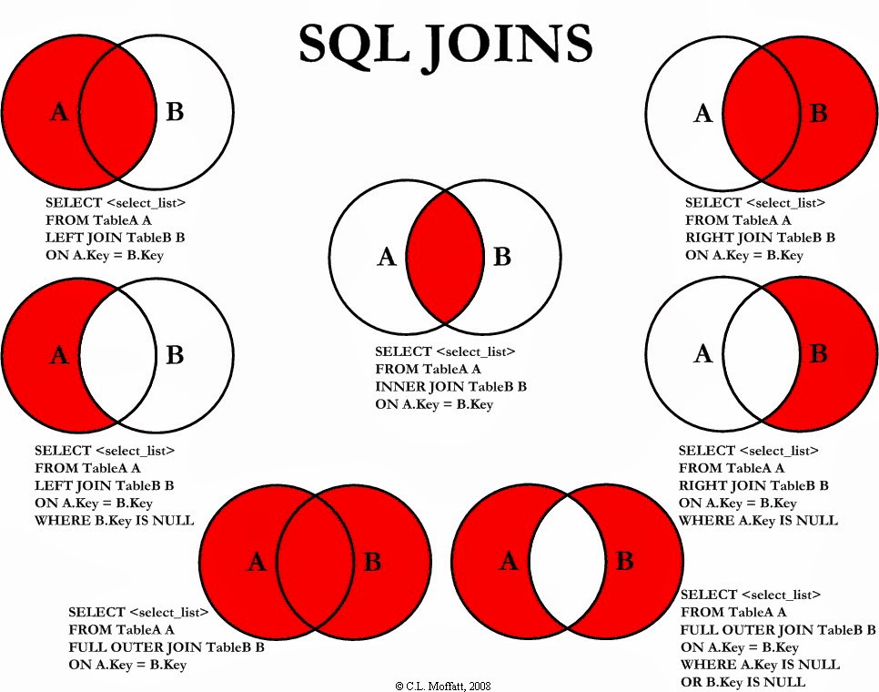

# DQL Avanzado - Parte 2

## **TIMESTAMPS y EXTRACT**

Recordemos que en PostgreSQL, podemos almacenar fechas y horas utilizando los siguientes tipos de datos:

- **TIME**: Solo contiene la hora (sin fecha).
- **DATE**: Solo contiene la fecha (sin hora).
- **TIMESTAMP**: Contiene tanto la fecha como la hora.
- **TIMESTAMPTZ**: Contiene la fecha, la hora y la zona horaria.

Es importante tener cuidado al diseñar bases de datos y al seleccionar el tipo de dato adecuado para las fechas, según los requisitos de la aplicación.

A continuación, exploraremos algunas funciones y operaciones que podemos realizar con tipos de datos de fecha:

### **Funciones de fecha en PostgreSQL**

- **NOW()**: Devuelve la fecha y hora actuales.
  
  ```sql
  SELECT NOW();
  ```

- **TIMEOFDAY()**: Devuelve la fecha y hora actual del día como cadena de texto.
  
  ```sql
  SELECT TIMEOFDAY();
  ```

- **CURRENT_TIME**: Devuelve la hora actual.
  
  ```sql
  SELECT CURRENT_TIME;
  ```

- **CURRENT_DATE**: Devuelve la fecha actual.
  
  ```sql
  SELECT CURRENT_DATE;
  ```

### **Funciones para extraer información de fechas**

- **EXTRACT()**: Permite "extraer" o obtener un subcomponente del valor de una fecha. Algunos de los componentes que podemos extraer son:

  - `YEAR`: El año.
  - `MONTH`: El mes.
  - `DAY`: El día.
  - `WEEK`: La semana del año.
  - `QUARTER`: El trimestre del año.

  **Ejemplo con Pagila:**
  Supongamos que tenemos una columna `rental_date` en la tabla `rental` que almacena la fecha de alquiler. Para obtener el año de cada alquiler, podemos usar la siguiente consulta:

  ```sql
  SELECT rental_id, EXTRACT(YEAR FROM rental_date) AS rental_year
  FROM rental LIMIT 5;
  ```

  **Resultado esperado:**
  

  
- **AGE()**: Calcula y devuelve la edad actual a partir de un timestamp. El resultado incluye años, meses, días, horas, minutos y segundos.

  **Ejemplo con Pagila:**
    Supongamos que tenemos una columna `rental_date` en la tabla `rental` que almacena la fecha de alquiler. Para calcular la diferencia entre la fecha de alquiler y la fecha actual, podemos usar:

    ```sql
    SELECT rental_id, AGE(rental_date) AS age
    FROM rental LIMIT 5;
    ```

    **Resultado esperado:**
    

- **TO_CHAR()**: Función general para convertir tipos de datos a texto. Es útil para formatear timestamps. Se puede utilizar con diferentes tipos de datos, no solo con timestamps.

  **Ejemplo con Pagila:**
  Para formatear la fecha de alquiler (`rental_date`) de la tabla `rental` a un formato específico:

  ```sql
  SELECT rental_id, TO_CHAR(rental_date, 'MM-DD-YYYY') AS formatted_date
  FROM rental LIMIT 5;
  ```

  **Resultado esperado:**</br>
  

  > Para aprender de todos los formatos que soporta `TO_CHAR` ver este [link](https://neon.tech/postgresql/postgresql-string-functions/postgresql-to_char)

### **Funciones adicionales de manejo de fechas**

- **TO_TIMESTAMP()**: Convierte una cadena de texto a un valor de timestamp.
  
  ```sql
  SELECT TO_TIMESTAMP('2025-02-08 15:30:00', 'YYYY-MM-DD HH24:MI:SS');
  ```

- **TO_DATE()**: Convierte una cadena de texto a un valor de fecha.

  ```sql
  SELECT TO_DATE('2025/02/08', 'YYYY-MM-DD');
  ```

### **Funciones de manipulación de fechas**

- **DATE_ADD() o `+`**: Suma un intervalo de tiempo a una fecha.
  
  **Ejemplo con Pagila:**
  Para sumar 10 días a la fecha de alquiler (`rental_date`):

  ```sql
  -- Opción 1:
  SELECT rental_id, rental_date, DATE_ADD(rental_date, INTERVAL '10 days') AS new_rental_date
  FROM rental LIMIT 5;
  -- Opción 2:
  SELECT rental_id, rental_date, rental_date + INTERVAL '10 days' AS new_rental_date
  FROM rental LIMIT 5;
  ```

- **`-`**: Calcula la diferencia entre dos fechas. El resultado es un intervalo.
  
  **Ejemplo con Pagila:**
  
  ```sql
  -- Para restar 5 días a la fecha de alquiler (`rental_date`):
  SELECT rental_id, rental_date, rental_date - INTERVAL '5 days' AS new_rental_date
  FROM rental LIMIT 5;
  -- Para calcular la diferencia en días entre la fecha de alquiler (`rental_date`) y la fecha actual:
  SELECT rental_id, rental_date, CURRENT_DATE - rental_date AS date_diff
  FROM rental LIMIT 5;
  -- 
  ```

### Ejercicios de TIMESTAMPS Y EXTRACT
1. Consulta los primeros 5 alquileres realizados en el mes de mayo de 2022. Utiliza la función EXTRACT para obtener el mes y año de la fecha de alquiler (`rental_date`).
```sql
SELECT rental_id, rental_date
FROM rental
WHERE EXTRACT(MONTH FROM rental_date) = 5
  AND EXTRACT(YEAR FROM rental_date) = 2022
LIMIT 5;
```
2. Queremos obtener el número de días que han pasado desde que cada alquiler fue realizado hasta la fecha actual. Usa la columna de la fecha de alquiler (`rental_date`).
```sql
SELECT rental_id, rental_date, AGE(rental_date) AS days_since_rental
FROM rental
LIMIT 10;
```
3. Calcula el total de alquileres realizados por año y muestra el resultado ordenado de mayor a menor.
```sql
SELECT EXTRACT(YEAR FROM rental_date) AS rental_year, COUNT(rental_id) AS total_rentals
FROM rental
GROUP BY rental_year
ORDER BY total_rentals DESC;
```

--- 

## **UNION, INTERSECT y EXCEPT en PostgreSQL**

Estas tres operaciones se utilizan para combinar resultados de múltiples consultas en PostgreSQL. A continuación, se describe brevemente cada una de ellas, junto con ejemplos utilizando el dataset **Pagila**.

---

### **UNION**

**`UNION`** combina los resultados de dos o más consultas `SELECT` y elimina las filas duplicadas. Las consultas deben devolver el mismo número de columnas con tipos de datos compatibles.

#### Sintaxis:
```sql
SELECT columnas FROM tabla1  
UNION  
SELECT columnas FROM tabla2;
```

#### Ejemplo:
Queremos obtener una lista de los `first_name` de empleados y clientes en **Pagila**:

```sql
SELECT first_name FROM staff  
UNION  
SELECT first_name FROM customer;
```

**Explicación:**  
Este `UNION` devolverá una lista de nombres (`first_name`) tanto de los empleados como de los clientes, eliminando duplicados.

> Para combinar los resultados sin eliminar las filas duplicadas usar `UNION ALL`.

---

### **INTERSECT**

**`INTERSECT`** devuelve solo las filas que están presentes en ambas consultas. Las filas duplicadas se eliminan.

#### Sintaxis:
```sql
SELECT columnas FROM tabla1  
INTERSECT  
SELECT columnas FROM tabla2;
```

#### Ejemplo:
Queremos obtener los `first_name` de empleados y clientes que tienen el mismo nombre:

```sql
SELECT first_name FROM staff  
INTERSECT  
SELECT first_name FROM customer;
```

**Explicación:**  
Este `INTERSECT` devuelve solo los nombres de personas que están tanto en la tabla `staff` como en la tabla `customer`.

---

### **EXCEPT**

**`EXCEPT`** devuelve las filas que están en la primera consulta pero no en la segunda. Al igual que `UNION`, elimina los duplicados.

#### Sintaxis:
```sql
SELECT columnas FROM tabla1  
EXCEPT  
SELECT columnas FROM tabla2;
```

### Ejemplo:
Queremos obtener los `first_name` de los empleados que no están en la tabla de clientes:

```sql
SELECT first_name FROM staff  
EXCEPT  
SELECT first_name FROM customer;
```

**Explicación:**  
Este `EXCEPT` devuelve los nombres de los empleados que no están presentes como clientes en la tabla `customer`.

---

## **Resumen:**

- **`UNION`**: Combina resultados de consultas y elimina duplicados.
- **`INTERSECT`**: Devuelve solo las filas comunes entre las consultas.
- **`EXCEPT`**: Devuelve las filas que están en la primera consulta pero no en la segunda.

Estas operaciones son útiles para comparar o combinar resultados de diferentes conjuntos de datos en PostgreSQL.

---

## JOINS
Los JOINS nos permitirán combinar información de varias tablas.

La razón principal para los diferentes tipos de JOINS es decidir cómo manejar la información presente en una de las tablas unidas.



### **INNER JOIN**
El `INNER JOIN` es el tipo de JOIN más común. Este tipo de JOIN devuelve las filas que tienen coincidencias en ambas tablas involucradas. Si no hay coincidencia en alguna de las tablas, no se devuelve ningún resultado para esa fila.
#### Sintaxis
```sql
SELECT columnas
FROM tabla1
INNER JOIN tabla2
ON tabla1.columna = tabla2.columna;
```

#### Ejemplo en pagila
Queremos obtener el nombre de los actores y el título de las películas en las que han actuado.
```sql
SELECT actor.first_name, actor.last_name, film.title
FROM actor
INNER JOIN film_actor ON actor.actor_id = film_actor.actor_id
INNER JOIN film ON film_actor.film_id = film.film_id;
```
Este ejemplo devuelve solo los actores que tienen una película asociada en el sistema.

> Nota: Por defecto en PostgreSQL, si usas solo `JOIN`, este será tratado como un `INNER JOIN`.

---

### **LEFT JOIN (o LEFT OUTER JOIN)**
El `LEFT JOIN` devuelve todas las filas de la tabla de la izquierda (tabla1) y las filas coincidentes de la tabla de la derecha (tabla2). Si no hay coincidencia en la tabla de la derecha, las columnas correspondientes de la tabla de la derecha serán `NULL`.
#### Sintaxis
```sql
SELECT columnas
FROM tabla1
LEFT JOIN tabla2
ON tabla1.columna = tabla2.columna;
```

#### Ejemplo con Pagila
```sql
SELECT film.title, inventory.inventory_id, inventory.last_update
FROM film
LEFT JOIN inventory
ON film.film_id = inventory.film_id;
```
Este ejemplo devuelve todas las películas de la tabla `film`, junto con los ID de inventario y fecha de última actualización de la tabla `inventory`. Si una película no tiene un inventario asociado, el valor de `inventory.inventory_id` e `inventory.last_update` será `NULL`.

Para ver los titulos de las peliculas sin inventario puedes ejecutar lo siguiente:
```sql
SELECT film.title, inventory.inventory_id, inventory.last_update
FROM film
LEFT JOIN inventory
ON film.film_id = inventory.film_id
WHERE inventory.inventory_id is NULL;
```

### **RIGHT JOIN**
El `RIGHT JOIN` es el opuesto al `LEFT JOIN`. Devuelve todas las filas de la tabla de la derecha (`tabla2`) y las filas coincidentes de la tabla de la izquierda (`tabla1`). Si no hay coincidencias en la tabla de la izquierda, las columnas correspondientes de la tabla de la izquierda serán `NULL`.
#### Sintaxis
```sql
SELECT columnas
FROM tabla1
RIGHT JOIN tabla2
ON tabla1.columna = tabla2.columna;
```
#### Ejemplo en pagila
Para este ejemplo vamos primero a insertar un nuevo empleado:
```sql
INSERT INTO staff (first_name, last_name, address_id, email, store_id, active, username, password)
VALUES (
    'David',
    'Obregon',
    4,
    'david@sakilastaff.com',
    1,
    true,
    'David',
    '123'
);
```
Ahora vamos a correr la siguiente consulta:
```sql
SELECT store.store_id, store.manager_staff_id, staff.first_name, staff.last_name
FROM store
RIGHT JOIN staff
ON store.manager_staff_id = staff.staff_id;
```
Este `RIGHT JOIN` busca las coincidencias entre las tablas `store` y `staff` basadas en el campo `manager_staff_id`. Específicamente, se busca el personal que está asignado como gerente de tienda. En el caso de que un miembro de personal no sea gerente de ninguna tienda, el resultado mostrará valores `NULL` en los campos de la tabla store. En este caso, `David` es personal de la tienda 1, pero no es el gerente de esta tienda.

### **FULL OUTER JOIN**
El `FULL OUTER JOIN` devuelve todas las filas de ambas tablas, y si no hay coincidencia en alguna de ellas, las columnas correspondientes de la tabla sin coincidencia serán `NULL`.
#### Sintaxis
```sql
SELECT columnas
FROM tabla1
FULL OUTER JOIN tabla2
ON tabla1.columna = tabla2.columna;
```
#### Ejemplo en pagila
```sql
SELECT inventory.inventory_id, inventory.film_id, film.title
FROM inventory
FULL OUTER JOIN film
ON inventory.film_id = film.film_id;
```
Si un inventario no tiene una película asociada, se devolverán los campos de inventory y film como NULL para ese caso. Si una película no tiene un inventario asociado, se devolverán los campos de film como NULL para ese caso.
> Debido a que la estructura de la base de datos de Pagila no incluye tablas con claves foráneas opcionales, no es posible obtener resultados en los que ambos lados del JOIN tengan valores `NULL`.

### **SELF JOIN**
Un `SELF JOIN` es simplemente cuando unes una tabla consigo misma. No existe una palabra clave `SELF JOIN`, solo escribes un `JOIN` común en el que ambas tablas involucradas en la unión son la misma tabla. Algo importante a notar es que, al hacer un self join, es necesario usar un alias `AS` para la tabla; de lo contrario, el nombre de la tabla sería ambiguo. Es útil cuando deseas correlacionar pares de filas de la misma tabla, por ejemplo, una relación padre-hijo o una relación empleado-gerente.
#### Sintaxis
```sql
SELECT columnas
FROM tabla AS t1
JOIN tabla AS t2
ON t1.columna = t2.columna;
```
#### Hipotético ejemplo
```sql
SELECT e.name, m.name AS manager 
FROM employee e
LEFT JOIN employee m 
ON m.employeeid = e.managerid;
```
Esto devolverá el nombre de cada empleado y el nombre de su gerente

## Ejercicios de JOINS
1. Usa un JOIN para mostrar el nombre y apellido, así como la dirección, de cada miembro del personal. Utilice las tablas `staff` y `address`.
2. Usa un JOIN para mostrar el monto total cobrado por cada miembro del personal en enero de 2022. Usa las tablas `staff` y `payment`.
3. Se solicita saber el nombre cada película y el número de actores que aparecen en ella. Utilice las `tablas film_actor` y `film`. Usa `INNER JOIN`.
4. ¿Cuántas copias de la película 'Hunchback Impossible' existen en el sistema de inventario?
5. Utilizando las tablas de `payment` y `customer` y el comando JOIN, enumere el total pagado por cada cliente. Devuelva el resultado en orden alfabético por apellido del cliente: 

---

## Common Table Expressions (CTE)
Una CTE (Common Table Expression) es una consulta temporal que se define dentro de una sentencia `SELECT`, `INSERT`, `UPDATE`, o `DELETE`. Permite organizar las consultas de forma más legible y reutilizable, y puede ser especialmente útil en consultas complejas que requieren varias subconsultas.

### Sintaxis básica:
```sql
WITH cte_name AS (
    -- Definición de la consulta temporal
    SELECT columnas
    FROM tabla
    WHERE condición
)
SELECT columnas
FROM cte_name;
```
La CTE se define con la palabra clave `WITH`, seguida del nombre de la CTE (en este caso cte_name), y una subconsulta que se ejecuta como parte de la consulta principal.

### Ventajas de las CTE:
- Mejora la legibilidad de consultas complejas.
- Permite evitar la repetición de subconsultas en diferentes partes de una consulta.
- Facilita el uso de consultas recursivas.
- Hace que la consulta sea más fácil de mantener y depurar.

#### Ejemplo 1: Uso básico de CTE
Devuelve los 10 títulos de las películas más alquiladas, junto con la cantidad de veces que fueron alquiladas, ordenados de mayor a menor.

```sql
WITH rental_counts AS (
    SELECT inventory.film_id, COUNT(rental.rental_id) AS rental_count
    FROM rental
    INNER JOIN inventory ON rental.inventory_id = inventory.inventory_id
    GROUP BY inventory.film_id
)
SELECT film.title, rental_counts.rental_count
FROM rental_counts
INNER JOIN film ON rental_counts.film_id = film.film_id
ORDER BY rental_counts.rental_count DESC
LIMIT 10;
```

**Explicación:**
1. CTE rental_counts:
  - Primero, se hace un `INNER JOIN` entre las tablas `rental` e `inventory` usando la columna `inventory_id`, para poder acceder al `film_id` en la tabla `inventory`.
  - Luego, contamos la cantidad de alquileres (`rental_count`) por cada `film_id`, agrupando por la columna `film_id` de la tabla inventory.
2. Consulta principal:
  - En la consulta principal, unimos la CTE `rental_counts` con la tabla `film` usando el `film_id`, para obtener el título de la película correspondiente a cada `film_id`.
  - Finalmente, ordenamos los resultados de mayor a menor por la cantidad de alquileres y limitamos los resultados a los 10 más alquilados.

#### Ejemplo 2: Uso junto con UPDATE
En este ejemplo, queremos actualizar el estado de los alquileres de películas que fueron alquiladas hace más de 7 días. Para hacerlo, primero agregamos una columna `status` a la tabla `rental` para almacenar el estado de cada alquiler.
```sql
ALTER TABLE rental
ADD COLUMN status VARCHAR(20);
```

Luego, usamos una CTE para seleccionar los alquileres que fueron realizados hace más de 7 días y que aún no han sido devueltos. Después, realizamos una actualización (`UPDATE`) para cambiar el valor de la columna status a `'overdue'` en esos alquileres:
```sql
WITH overdue_rentals AS (
    SELECT rental_id, rental_date
    FROM rental
    WHERE CURRENT_DATE - rental_date > INTERVAL '7 days' AND return_date IS NULL
)
UPDATE rental
SET status = 'overdue'
FROM overdue_rentals
WHERE rental.rental_id = overdue_rentals.rental_id;
```

Finalmente, podemos comprobar que los alquileres han sido actualizados correctamente ejecutando la siguiente consulta para obtener todos los alquileres cuyo estado es `'overdue'`:
```sql
SELECT * 
FROM rental 
WHERE status = 'overdue';
```

Este flujo de trabajo muestra cómo las CTEs pueden ser útiles para realizar actualizaciones complejas de manera eficiente, primero seleccionando los registros que deben actualizarse y luego aplicando la modificación a esos registros.

### Consideraciones importantes sobre CTEs:
- **Alcance limitado**: Las CTEs solo son visibles dentro de la consulta en la que se definen. No se pueden usar fuera de esa consulta.
- **Performance**: Las CTEs pueden mejorar la legibilidad de la consulta, pero no siempre tienen un impacto positivo en el rendimiento.
- Hay otro tipos de CTEs llamados CTEs recursivos que es importante conocer pero no son tan usadas y pueden tener un impacto en el rendimiento sino se manejan bien. Para ver un ejemplo de CTEs recursivos, ir al siguiente [link](https://learnsql.es/blog/que-es-una-cte-recursiva-en-sql/).

## Ejercicios de CTEs
1. Usa una CTE para calcular el total de ingresos generados por cada película (mostrar el titulo de la película) en el año 2022. Asegúrate de usar `JOIN` con las tablas `rental` e `inventory` para obtener la información.
> Puedes crear un CTE para calcular el totdal de ingresos por `film_id` y luego usar el CTE para hacer un join con la tabla `film` y mostrar el titulo de la pelicula y el revenue.

---

## VIEWS
### ¿Qué es una VIEW?
Una `VIEW` (Vista) en SQL es una tabla virtual que se define a partir de una consulta `SELECT`. Aunque no es una tabla física en la base de datos, las vistas pueden ser tratadas como si fueran tablas en las consultas, lo que permite simplificar y organizar las consultas complejas. Una vista puede incluir datos de una o más tablas, y permite ocultar la complejidad de las consultas subyacentes.

### Beneficios de las VIEWS:
- **Simplificación**: Puedes simplificar consultas complejas, ocultando detalles y creando vistas fáciles de usar.
- **Seguridad**: Puedes limitar el acceso a ciertas columnas o datos sensibles mostrando solo la información necesaria.
- **Reutilización**: Una vez creada una vista, puedes reutilizarla en varias consultas sin necesidad de escribir la misma consulta repetidamente.
- **Mantenimiento**: Facilita el mantenimiento de las consultas, ya que cualquier cambio en la lógica de la vista solo necesita hacerse una vez.

### Sintaxis para crear una VIEW:
```sql
CREATE VIEW view_name AS
SELECT columnas
FROM tabla
WHERE condición;
```
- `view_name`: El nombre que se le asignará a la vista.
- `SELECT`: La consulta `SELECT` que define qué datos estarán disponibles en la vista.

#### Sintaxis para eliminar una VIEW:
```sql
DROP VIEW view_name;
```

#### Ejemplo 1: Crear una vista simple
Supongamos que queremos crear una vista para mostrar los nombres de los empleados (`first_name`, `last_name`) y el nombre de la tienda (`store_id`) donde trabajan.
```sql
CREATE VIEW employee_store AS
SELECT first_name, last_name, store_id
FROM staff;
```

**Explicación:**

- Se crea una vista llamada `employee_store` que contiene los `first_name`, `last_name` y `store_id` de la tabla `staff`.
- Esta vista se puede consultar como una tabla en lugar de escribir la consulta `SELECT` cada vez.

Para usar la vista:
```sql
SELECT * FROM employee_store;
```

#### Ejemplo 2: Usar una vista para simplificar consultas
Supongamos que se necesita realizar varias consultas para obtener la cantidad total de alquileres por película. Podemos crear una vista que simplifique este proceso.
```sql
CREATE OR REPLACE VIEW film_rentals AS
SELECT inventory.film_id, COUNT(rental.rental_id) AS rental_count
FROM rental
INNER JOIN inventory ON rental.inventory_id = inventory.inventory_id
GROUP BY inventory.film_id;
```

**Explicación:**

- Se crea una vista llamada `film_rentals` que cuenta cuántas veces se ha alquilado cada película (`rental_count`), usando las tablas `rental` e `inventory`.

Para consultar los alquileres por película:
```sql
SELECT film_id, rental_count FROM film_rentals;
```

> Note que ahora usé la expresión `CREATE OR REPLACE VIEW` la cual puede ser usada para crear la vista en caso de que no exista, y si ya existe, reemplaza la vista existente por la nueva definición.

### Updatable Views (Vistas actualizables)
En general, las vistas en PostgreSQL son actualizables cuando cumplen las siguientes condiciones:
1. Primero, la consulta que define la vista debe tener exactamente una entrada en la cláusula `FROM`, que puede ser una tabla u otra vista actualizable.
2. Segundo, la consulta que define la vista no debe contener ninguna de las siguientes cláusulas a nivel superior:
  - GROUP BY
  - HAVING
  - LIMIT
  - OFFSET FETCH
  - DISTINCT
  - WITH
  - UNION
  - INTERSECT
  - EXCEPT
3. Tercero, la lista de selección de la consulta que define la vista no debe contener ninguna de las siguientes:
  - Funciones de ventana
  - Funciones de agregación

Una vista actualizable puede contener columnas actualizables y no actualizables. Si intenta modificar una columna no actualizable, PostgreSQL generará un error.

#### Ejemplo de Updatable View
Vamos a crear un ejemplo donde modificamos el atributo `populatio`n en la tabla `city` de Pagila. Como primero debemos agregar este atributo (porque no existe en la tabla), lo haremos paso a paso.
```sql
ALTER TABLE city
ADD COLUMN population INTEGER;
```
Este comando agrega la columna `population` a la tabla `city`, que será de tipo `INTEGER`.

A continuación, vamos a crear una vista que permita actualizar el campo population de la tabla `city`.
```sql
CREATE VIEW city_population_view AS
SELECT city_id, city, country_id, population
FROM city
```
**Explicación:**

- Creamos la vista `city_population_view`, que selecciona `city_id`, `city`, `country_id` y `population` de la tabla `city`. Dado que la vista solo se basa en una tabla (sin agregaciones o JOIN), es actualizable.

Ahora que tenemos la vista `city_population_view`, podemos realizar actualizaciones a través de ella. Supongamos que queremos actualizar la población de la ciudad con `city_id = 1`.
```sql
UPDATE city_population_view
SET population = 5000000
WHERE city_id = 1;
```
**Explicación:**
- Usamos la vista `city_population_view` para actualizar el valor de la columna `population` para la ciudad cuyo `city_id` es 1. Esta operación modifica directamente la tabla `city` porque la vista es actualizable.

### WITH CHECK OPTION
El `WITH CHECK OPTION` es una cláusula que se puede agregar al crear una vista para asegurarse de que las filas insertadas o actualizadas a través de la vista cumplan con las condiciones de la consulta de la vista. Si se intenta insertar o actualizar una fila que no cumpla con la condición especificada en la vista, PostgreSQL rechazará la operación.

#### Sintaxis para crear una vista con WITH CHECK OPTION:
```sql
CREATE VIEW view_name AS
SELECT columnas
FROM tabla
WHERE condición
WITH CHECK OPTION;
```

**Explicación:**

- `WITH CHECK OPTION`: Asegura que las modificaciones realizadas a través de la vista (tanto `INSERT` como `UPDATE`) solo afecten a las filas que cumplen la condición de la consulta de la vista.

#### Ejemplo
Ahora, vamos a modificar la vista creada anteriormente `city_population_view` para agregar la cláusula `WITH CHECK OPTION`. Esto asegurará que cualquier fila insertada o actualizada a través de la vista cumpla con las condiciones especificadas en la vista.
Pero antes, vamos a hacer el ejemplo sin `WITH CHECK OPTION`

```sql
CREATE OR REPLACE VIEW city_population_view AS
SELECT city_id, city, country_id, population
FROM city
WHERE population >= 10000;
```

Hemos reemplazado la vista para solo mostrar ciudades con una población mayor a 10000. Si intentamos agregar un nuevo registro usando la vista con una población menor a 10000, lo podemos hacer sin problema:
```sql
INSERT INTO city_population_view (city, country_id, population)
VALUES ('New City', 13, 500);
```

Ahora, reemplacemos la vista y agreguemos `WITH CHECK OPTION`
```sql
CREATE OR REPLACE VIEW city_population_view AS
SELECT city_id, city, country_id, population
FROM city
WHERE population >= 10000
WITH CHECK OPTION;
```

- La vista ahora solo permitirá insertar o actualizar registros donde la population sea mayor o igual a 10,000.
`WITH CHECK OPTION`: Esto asegura que las modificaciones realizadas a través de esta vista (ya sea mediante `INSERT` o `UPDATE`) solo sean posibles si cumplen con la condición `population >= 10000`. Si intentamos insertar o actualizar un registro que no cumpla esta condición, la operación será rechazada.


Ahora si intentamos agregar un registro donde la población es menor a 10000, PostgreSQL va a mostrar un error:
```sql
INSERT INTO city_population_view (city, country_id, population)
VALUES ('New City', 13, 500);
```
 
El error mostrado debe ser algo como esto:
```
Failing row contains (605, New City, 13, 2025-02-09 15:09:09.236558-05, 500).new row violates check option for view "city_population_view" 
```

### Materialized Views en PostgreSQL
Una **Materialized View** en PostgreSQL es similar a una vista regular, pero en lugar de ser una consulta dinámica que se ejecuta cada vez que se accede, una materialized view guarda los resultados de la consulta en una tabla física. Esto significa que los datos no se actualizan automáticamente, lo que mejora el rendimiento al evitar la necesidad de recalcular la consulta repetidamente. Sin embargo, esto también significa que los datos pueden volverse obsoletos si las tablas subyacentes cambian.

#### Ventajas de las Materialized Views:
- **Rendimiento**: Las consultas a las materialized views son mucho más rápidas que las vistas regulares, ya que los resultados ya están almacenados.
- **Optimización para consultas complejas**: Son útiles cuando necesitas consultar datos complejos, como uniendo varias tablas, y quieres evitar recalcular esos resultados repetidamente.

#### Sintaxis para crear una Materialized View:
```sql
CREATE MATERIALIZED VIEW view_name AS
SELECT columnas
FROM tabla
WHERE condición;
```

#### Sintaxis para actualizar una Materialized View:
```sql
REFRESH MATERIALIZED VIEW view_name;
```
- `REFRESH MATERIALIZED VIEW`: Actualiza los datos almacenados en la materialized view, recargando los resultados de la consulta subyacente.

#### Ejemplo de Materialized View en Pagila:
Imaginemos que queremos crear una materialized view que nos muestre el total de alquileres (`rental_count`) por película. Usaremos las tablas `rental` y `inventory`.
```sql
CREATE MATERIALIZED VIEW film_rental_count AS
SELECT inventory.film_id, COUNT(rental.rental_id) AS rental_count
FROM rental
INNER JOIN inventory ON rental.inventory_id = inventory.inventory_id
GROUP BY inventory.film_id;
```

**Explicación:**

- La materialized view `film_rental_count` cuenta cuántas veces se ha alquilado cada película, uniendo las tablas `rental` e `inventory`.
Este cálculo solo se realiza una vez cuando se crea la materialized view, lo que mejora el rendimiento en consultas posteriores.

Para ver la data de la vista:
```sql
SELECT * FROM film_rental_count;
```

Ahora imaginemos que un cliente ha alquilado una nueva película. Vamos a insertar un nuevo registro en la tabla rental, asociando un `inventory_id` y un `film_id`
```sql
INSERT INTO rental (inventory_id, rental_date, customer_id, staff_id)
VALUES (1, CURRENT_DATE, 2, 1); 
```

Este `INSERT` agrega un nuevo alquiler a la tabla `rental` que corresponde a la `film_id = 1`, pero la materialized view `film_rental_count` no se actualiza automáticamente, por lo que los resultados de la vista no reflejan este nuevo alquiler.

Ahora consultemos los registros de la vista para el `film_id = 1`:
```sql
SELECT * FROM film_rental_count WHERE film_id = 1;
```

Y posteriormente actualicemos la vista, para verificar como se actualizan los registros:
```sql
REFRESH MATERIALIZED VIEW film_rental_count;
```

Luego nuevamente podemos ver los registros de la pelicula y se evidencia como el `rental_count` se actualizó.
```sql
SELECT * FROM film_rental_count WHERE film_id = 1;
```

## Ejercicios de Vistas
1.  Muestra los cinco géneros con mayores ingresos brutos en orden descendente. Los generos son los `category.name`. Tienes que hacer JOINs entre las tablas `category`, `inventory`, `rental` y `payment`. Ingresos brutos se refiere a la sumatoria de los ingresos totales de ese genero `SUM(p.amount)`.
2. En su nuevo rol como ejecutivo, le gustaría tener una manera sencilla de visualizar los cinco géneros principales por ingresos brutos. Utilice la solución del problema anterior para crear una vista.
3. Muestra la vista y posteriormente borrala.

--- 


## Bibliografía
- Silberschatz, A., Korth, H. F., & Sudarshan, S. (2019). Database System Concepts (7th ed.). McGraw Hill Education.
- https://www.sqlcourse.com/advanced-course/tutorial-intro/
- https://neon.tech/postgresql/postgresql-views
- https://www.postgresql.org/docs
- https://www.udemy.com/course/the-complete-sql-bootcamp/learn/lecture/18335690#overview
- https://learnsql.es/blog/que-es-una-cte-recursiva-en-sql/
