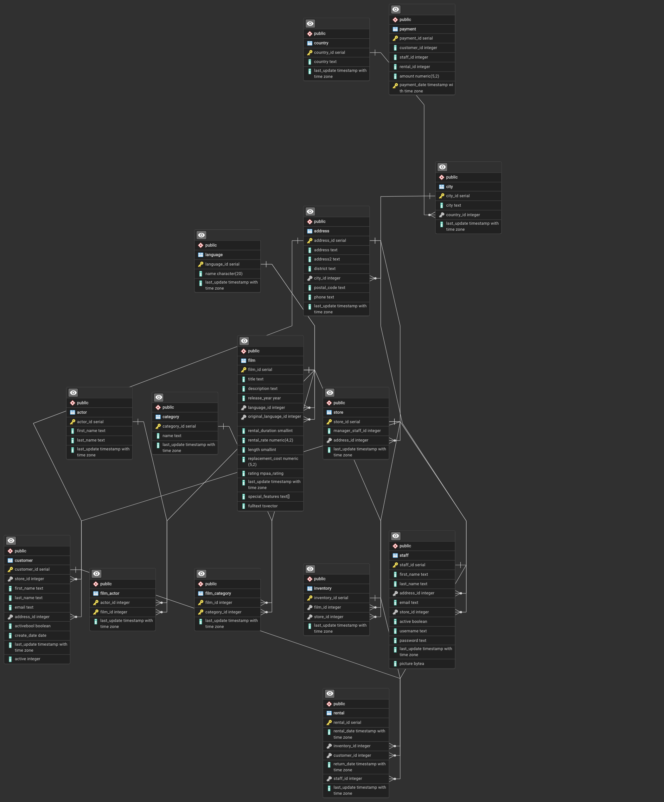

# DQL Avanzado

## 📂 Dataset para la clase: Pagila

El dataset **Pagila** es un esquema de base de datos de ejemplo basado en [Sakila](https://dev.mysql.com/doc/sakila/en/), el dataset de ejemplo de MySQL, pero adaptado para **PostgreSQL**. Está diseñado para demostrar las características de una base de datos relacional con un caso de uso centrado en una tienda de alquiler de películas.

Este esquema incluye **tablas, relaciones, restricciones y funcionalidades avanzadas de PostgreSQL**, lo que lo convierte en una excelente herramienta de aprendizaje.

🔗 **Descargar el dataset:**  
Puedes obtener el script SQL desde la siguiente URL:  
[Pagila.sql](https://raw.githubusercontent.com/neondatabase/postgres-sample-dbs/main/pagila.sql)

### 📌 Estructura de la base de datos

A continuación, se muestra la estructura de la base de datos **Pagila**:



---

## 🛠 Restaurar la base de datos Pagila

Dependiendo de si estás trabajando en **local** o en **Neon.tech**, el proceso de restauración varía. A continuación, se presentan ambos métodos.

### 🖥️ Restauración en Localhost

1️⃣ Crear una base de datos llamada `pagila` en PostgreSQL.  
2️⃣ Restaurar la base de datos utilizando `psql` con el siguiente comando:

```sh
psql -U postgres -d pagila -f pagila.sql
```
3️⃣ Ingresar la contraseña cuando se solicite.
4️⃣ Verificar la restauración ejecutando la siguiente consulta en PostgreSQL usando `pgAdmin4`:
```sql
SELECT * FROM film LIMIT 10;
```

### ☁️ Restauración en Neon.tech
1️⃣ Acceder a Neon.tech e iniciar sesión.
2️⃣ Crear la base de datos ejecutando:
```sql
CREATE DATABASE pagila;
```
3️⃣ Restaurar la base de datos utilizando `psql` con el siguiente comando:

```sh
psql -d "postgresql://[user]:[password]@[neon_hostname]/pagila" -f pagila.sql
```
🔹 Reemplaza [user], [password] y [neon_hostname] con las credenciales de tu base de datos en Neon.

4️⃣ Conectarse a la base de datos desde la interfaz de usuario de Neon.tech.
5️⃣ Verificar la restauración ejecutando la siguiente consulta en PostgreSQL:
```sql
SELECT * FROM film LIMIT 10;
```
---

## Recordemos...

### SELECT
Con el comando `SELECT` en SQL, los usuarios pueden acceder a datos y recuperar registros específicos en función de diversas condiciones, lo que lo convierte en una herramienta **esencial** para administrar y analizar datos.

#### Sintaxis básica
```sql
SELECT A1, A2, ...
 FROM r1, r2, ...
 WHERE P;
```
Donde:
- `Ai` son atributos (columnas).
- `ri` son relaciones (tablas).
- `P` es el predicado de selección (filas).

---

## DISTINCT y ALL
Las palabras clave `ALL` y `DISTINCT` se utilizan para definir si se deben seleccionar **todos los registros** o únicamente los registros **únicos** en los resultados de una consulta.

- `ALL` (predeterminado):  
  Muestra **todas** las filas, incluyendo los valores duplicados en la columna o columnas seleccionadas.

- `DISTINCT`:  
  Elimina los registros duplicados y sólo muestra los valores únicos en las columnas seleccionadas después del `SELECT`.

Si no se especifica ninguna opción, `ALL` es el comportamiento predeterminado.

---

### Ejemplo en la base de datos Pagila

Supongamos que queremos obtener una lista de las diferentes categorías de películas en la tienda.

**Consulta con `ALL` (predeterminado)**  
Esta consulta muestra **todas** las categorías asignadas a las películas, incluyendo duplicados:

```sql
SELECT category_id  
FROM film_category;
```

**Consulta con `DISTINCT`**  
Si queremos ver sólo **las categorías únicas** de películas, usamos `DISTINCT`:

```sql
SELECT DISTINCT category_id  
FROM film_category;
```

**Diferencia clave:**  
- La primera consulta devuelve **todas** las apariciones de `category_id`, incluyendo duplicados.  
- La segunda consulta elimina duplicados y sólo muestra **valores únicos**.

**Ejemplo con nombres en lugar de IDs**  
Si queremos ver todos los nombres diferentes de clientes sin duplicados:

```sql
SELECT DISTINCT first_name  
FROM customer;
```

---
## 📌 **Alias en SQL con `AS` (RENAME)**  

En SQL, el operador **`AS`** se usa para renombrar **columnas** y **tablas** en los resultados de una consulta. Es una herramienta útil para mejorar la legibilidad y organización de los datos.  

---

## 🔹 **Uso de `AS` para renombrar columnas**  
El alias en columnas se utiliza para cambiar el nombre de una columna en los resultados sin modificar la estructura real de la base de datos.  

#### 📌 **Sintaxis**  
```sql
SELECT columna AS nuevo_nombre
FROM tabla;
```

🔹 **Ejemplo en la base de datos `Pagila`**  
En la base de datos Pagila, podemos cambiar el nombre de `rental_rate` a "Tarifa de Renta" en la salida de la consulta:
```sql
SELECT title, rental_rate AS "Tarifa de Renta"
FROM film;
```

🔹 **Explicación:**

- `title`: Se mantiene igual.
- `rental_rate AS "Tarifa de Renta"`: Se mostrará con el alias "Tarifa de Renta" en la salida de la consulta.

---

## 🔹 Uso de AS para renombrar tablas
También podemos asignar alias a las tablas para escribir consultas más cortas y legibles.

#### 📌 **Sintaxis**  
```sql
SELECT alias.columna
FROM tabla AS alias;
```

🔹 **Ejemplo en la base de datos `Pagila`**  
Podemos asignar un alias a la tabla `film` para escribir consultas más concisas:
```sql
SELECT f.title, f.rental_duration
FROM film AS f;
```
🔹 **Explicación:**

- Se asigna el alias `f` a `film`.
- En la consulta, podemos referirnos a `film` como `f`, reduciendo la escritura.

---

## 📌 Funciones Matemáticas en SQL

### 📢 **Operadores Aritméticos Básicos en SQL**
SQL, siguiendo el estándar **ANSI SQL-92**, soporta los siguientes operadores aritméticos básicos:

| Operador | Descripción |
|----------|------------|
| `+` | Suma |
| `-` | Resta |
| `*` | Multiplicación |
| `/` | División |
| `%` | Módulo (Residuo de la división, **no estándar en ANSI SQL-92** pero soportado en muchos RDBMS) |

🔹 **Ejemplo en la base de datos `Pagila`**  
Consultar el **doble del precio de renta** de cada película en la tabla `film`:

```sql
SELECT title, rental_rate, rental_rate * 2 AS doble_renta  
FROM film;  
```

> 📝 Nota: Observe que se puede usar `AS` para renombrar expresiones calculadas.

📌 **Ejemplo del operador `%` (Módulo)**  
Mostrar si el **rental_duration** de una película es par o impar:
```sql
SELECT title, rental_duration, rental_duration % 2 AS es_impar  
FROM film;  
```

Si el resultado es `1`, significa que la duración es impar; si es `0`, es par.

---

### 📢 **Funciones Matemáticas en SQL**
Además de los operadores básicos, SQL incluye varias **funciones matemáticas** que pueden ser útiles en consultas analíticas y reportes.

#### 📌 1. `ABS(x)`: **Valor absoluto**
Devuelve el **valor absoluto** de un número, eliminando su signo negativo.

**Ejemplo:** Obtener el **valor absoluto de la diferencia** entre la tarifa de alquiler (`rental_rate`) y el costo de reemplazo (`replacement_cost`) de una película:

```sql
SELECT title, rental_rate, replacement_cost,  
ABS(rental_rate - replacement_cost) AS diferencia_absoluta  
FROM film;  
```

---

#### 📌 2. `SIGN(x)`: **Signo de un número**
Devuelve el **signo de un número**:
- `1` si es positivo.
- `0` si es cero.
- `-1` si es negativo.

**Ejemplo:** Evaluar si la diferencia entre `rental_rate` y `replacement_cost` es positiva o negativa:
```sql
SELECT title, rental_rate, replacement_cost,  
SIGN(rental_rate - replacement_cost) AS signo_diferencia  
FROM film;  
```

---

#### 📌 3. `MOD(x, y)`: **Residuo de una división (Módulo)**
Es equivalente al operador `%`, devuelve el residuo de la división de `x / y`.

**Ejemplo:** Determinar si la duración de alquiler (`rental_duration`) de una película es múltiplo de 3:

```sql
SELECT title, rental_duration,  
MOD(rental_duration, 3) AS residuo_modulo  
FROM film;  
```

Si el resultado es `0`, significa que el número es múltiplo de `3`.

---

#### 📌 4. `FLOOR(x)`: **Mayor entero menor o igual a `x`**
Devuelve el **mayor número entero** menor o igual a `x`.

**Ejemplo:** Obtener el **costo de reemplazo redondeado hacia abajo**:
```sql
SELECT title, replacement_cost,  
FLOOR(replacement_cost) AS costo_redondeado_abajo  
FROM film;  
```

---

#### 📌 5. `CEILING(x)` o `CEIL(x)`: **Menor entero mayor o igual a `x`**
Devuelve el **menor número entero** mayor o igual a `x`.

**Ejemplo:** Redondear el `replacement_cost` hacia arriba:
```sql
SELECT title, replacement_cost,  
CEILING(replacement_cost) AS costo_redondeado_arriba  
FROM film;  
```

---

#### 📌 6. `POWER(x, y)`: **Potencia**
Devuelve `x` elevado a la potencia `y`.

**Ejemplo:** Elevar la tarifa de renta al cuadrado (`rental_rate²`):

```sql
SELECT title, rental_rate,  
POWER(rental_rate, 2) AS renta_al_cuadrado  
FROM film;  
```

---

#### 📌 7. `ROUND(x)`: **Redondeo**
Redondea `x` al entero más cercano.

**Ejemplo:** Redondear el costo de reemplazo (`replacement_cost`):
```sql
SELECT title, replacement_cost,  
ROUND(replacement_cost) AS costo_redondeado  
FROM film;  
```

📌 **Redondear a un número específico de decimales**  
Usando `ROUND(x, d)`, donde `d` es el número de decimales deseados.

```sql
SELECT title, replacement_cost,  
ROUND(replacement_cost, 1) AS costo_redondeado_1decimal  
FROM film;  
```

---

#### 📌 8. `SQRT(x)`: **Raíz cuadrada**
Devuelve la **raíz cuadrada** de `x`.

**Ejemplo:** Obtener la raíz cuadrada del costo de reemplazo:

```sql
SELECT title, replacement_cost,  
SQRT(replacement_cost) AS raiz_cuadrada_costo  
FROM film;  
```

---

## 🎯 **Resumen**
| Función | Descripción |
|---------|------------|
| `ABS(x)` | Devuelve el **valor absoluto** de `x`. |
| `SIGN(x)` | Devuelve `-1`, `0` o `1` según si `x` es negativo, cero o positivo. |
| `MOD(x, y)` | Devuelve el **residuo** de `x / y`. |
| `FLOOR(x)` | Redondea `x` hacia abajo. |
| `CEIL(x)` o `CEILING(x)` | Redondea `x` hacia arriba. |
| `POWER(x, y)` | Devuelve `x` elevado a `y`. |
| `ROUND(x)` | Redondea `x` al entero más cercano. |
| `ROUND(x, d)` | Redondea `x` a `d` decimales. |
| `SQRT(x)` | Devuelve la **raíz cuadrada** de `x`. |


---

## 📊 Funciones de Agregación y `GROUP BY` en SQL

Las **funciones de agregación** permiten realizar cálculos sobre un conjunto de valores y devolver un único resultado resumido. Estas funciones se usan para obtener información agregada como el número total de registros, la suma de valores, el promedio, el valor mínimo o el máximo dentro de una columna.

Cuando queremos aplicar estas funciones **por grupos de datos**, utilizamos la cláusula `GROUP BY`. 

---

### 🔹 **Funciones de Agregación en SQL**
Las funciones de agregación operan sobre columnas de datos y permiten realizar cálculos como sumas, promedios y conteos.

| Función  | Descripción |
|----------|------------|
| `MIN`  | Devuelve el valor más pequeño en una columna. |
| `MAX`  | Devuelve el valor más grande en una columna. |
| `SUM`  | Calcula la suma de los valores numéricos en una columna. |
| `AVG`  | Calcula el promedio de los valores de una columna. |
| `COUNT` | Devuelve la cantidad total de valores en una columna. |
| `COUNT(*)` | Devuelve el número total de filas en una tabla. |

Las funciones de agregación **se pueden usar solas o con `GROUP BY`**.

---

### 🔹 **Uso de Funciones de Agregación sin `GROUP BY`**

Si se aplican funciones de agregación sin `GROUP BY`, se realiza el cálculo sobre **toda la tabla**.

#### **Ejemplo: Contar el total de películas en la tabla `film`**
```sql
SELECT COUNT(*) FROM film;
```

#### **Ejemplo: Obtener el precio máximo de renta en la tabla `film`**
```sql
SELECT MAX(rental_rate) FROM film;
```

#### **Ejemplo: Calcular el promedio de duración de las películas**
```sql
SELECT AVG(length) FROM film;
```

---

### 🔹 **Uso de `GROUP BY`**

La cláusula `GROUP BY` se usa junto con funciones de agregación para **agrupar los datos según una columna específica**. 

### 🔹 **Sintaxis de `GROUP BY`**

```SQL
SELECT columna1, SUM(columna2)
FROM "lista-de-tablas"
GROUP BY "lista-de-columnas";
```

**Reglas de `GROUP BY`:**
1. `GROUP BY` debe aplicarse a una o más columnas de la tabla.
2. Todas las columnas en el `SELECT` que **no sean funciones de agregación**, deben estar en `GROUP BY`.
3. `GROUP BY` se usa para obtener resultados agregados por grupo.

#### **Ejemplo: Calcular el promedio de duración de las películas por cada rating**
```sql
SELECT rating, AVG(length) 
FROM film 
GROUP BY rating;
```

#### **Ejemplo: Calcular la duración mínima, máxima, total y promedio por rating**
```sql
SELECT 
  rating,
  MIN(length) AS duracion_minima, 
  MAX(length) AS duracion_maxima, 
  SUM(length) AS duracion_total, 
  AVG(length) AS duracion_promedio
FROM film
GROUP BY rating;
```

### 🔹 **Resumen `GROUP BY` y funciones de agregación**
- **Las funciones de agregación** permiten realizar cálculos sobre conjuntos de datos.
- **Sin `GROUP BY`**, las funciones de agregación operan sobre toda la tabla.
- **Con `GROUP BY`**, se agrupan los datos y se aplican funciones de agregación a cada grupo.

> 📝 Nota: Observe que se pueden renombrar el resultado de una función de agregación con `AS`.

---

## 📌 `HAVING` en SQL

La cláusula `HAVING` en SQL se utiliza para **filtrar los resultados de una consulta después de aplicar `GROUP BY`**. Es similar a `WHERE`, pero `HAVING` se usa específicamente para filtrar **grupos de datos agregados**, mientras que `WHERE` filtra **filas individuales**.


### 🔹 **Uso de `HAVING`**

### 🔹 **Sintaxis de `HAVING`**
```sql
SELECT columna1, SUM(columna2)
FROM "lista-de-tablas"
GROUP BY "lista-de-columnas"
HAVING "condición";
```

Si queremos mostrar **sólo las clasificaciones (`rating`) con más de 200 películas**, usamos `HAVING`:

#### **Ejemplo: Filtrar clasificaciones con más de 200 películas**
```sql
SELECT rating, COUNT(*) 
FROM film 
GROUP BY rating 
HAVING COUNT(*) > 200;
```

**Explicación:**
- `GROUP BY rating`: Agrupa las películas por clasificación (`rating`).
- `COUNT(*)`: Cuenta cuántas películas hay en cada grupo.
- `HAVING COUNT(*) > 200`: Filtra los grupos para mostrar sólo los que tienen más de 200 películas.

---

### 🔹 **Diferencia entre `WHERE` y `HAVING`**
| Cláusula  | Se usa para... | Funciona con... |
|-----------|---------------|----------------|
| `WHERE`   | Filtrar filas antes de agrupar. | Cualquier columna de la tabla. |
| `HAVING`  | Filtrar grupos después de agrupar. | Funciones de agregación (`COUNT`, `SUM`, `AVG`, etc.). |

Si queremos filtrar **antes de agrupar**, usamos `WHERE`.  
Si queremos filtrar **después de agrupar**, usamos `HAVING`.

---

### 🔹 **Combinando `WHERE` y `HAVING`**
Podemos combinar `WHERE` y `HAVING` en la misma consulta.  
**Ejemplo:** Filtrar películas que tienen una duración mayor a 60 minutos (`WHERE`), y luego contar cuántas hay por clasificación (`GROUP BY`). Finalmente, mostramos sólo las clasificaciones con más de 150 películas (`HAVING`).

#### **Ejemplo: Filtrar películas con duración > 60 min y contar sólo las clasificaciones con más de 150 películas**
```sql
SELECT rating, COUNT(*) 
FROM film 
WHERE length > 60 
GROUP BY rating 
HAVING COUNT(*) > 150;
```

### 🔹 **Resumen `HAVING`**
- **`WHERE`** filtra filas antes de agrupar (`GROUP BY`).
- **`HAVING`** filtra los grupos después de aplicar `GROUP BY`.
- **Se pueden usar ambos juntos** para aplicar filtros antes y después del agrupamiento.

---

## 📌 `ORDER BY` en SQL

La cláusula `ORDER BY` se usa en SQL para **ordenar los resultados de una consulta** en orden ascendente (`ASC`) o descendente (`DESC`). Es una cláusula opcional que permite organizar los datos de manera más legible y estructurada.

---

## 🔹 **Sintaxis de `ORDER BY`**

```sql
SELECT columna1, columna2  
FROM tabla  
ORDER BY columna1 [ASC | DESC];
```

- `ASC` (**Ascendente**): Ordena los resultados de menor a mayor (por defecto si no se especifica).
- `DESC` (**Descendente**): Ordena los resultados de mayor a menor.

---

## 🔹 **Ejemplo: Ordenar películas por duración (menor a mayor)**  

Queremos obtener todas las películas ordenadas por su duración (`length`) en orden ascendente:

```SQL
SELECT title, length 
FROM film 
ORDER BY length ASC;
```

Lo cual equivale también a:
```sql
SELECT title, length 
FROM film 
ORDER BY length;
```

**Explicación:**
- `ORDER BY length ASC` o `ORDER BY length`: Ordena las películas de menor a mayor duración.

---

## 🔹 **Ejemplo: Ordenar películas por duración en orden descendente**  

Si queremos ver las películas más largas primero, usamos `DESC`:

```sql
SELECT title, length 
FROM film 
ORDER BY length DESC;
```
---

## 🔹 **Ejemplo: Ordenar por múltiples columnas**  

Podemos ordenar por más de una columna. Si queremos ordenar las películas por clasificación (`rating`) y, dentro de cada clasificación, ordenarlas por duración (`length`), hacemos lo siguiente:

```sql
SELECT title, rating, length 
FROM film 
ORDER BY rating ASC, length DESC;
```

**Explicación:**
- `ORDER BY rating ASC`: Ordena las películas por clasificación en orden alfabético.
- `length DESC`: Dentro de cada clasificación, las películas se ordenan de mayor a menor duración.

---

## 🔹 **Ejemplo: Ordenar usando una función de agregación**  

Si queremos contar cuántas películas hay por clasificación (`rating`) y ordenarlas de mayor a menor cantidad, usamos `COUNT(*)` junto con `ORDER BY`:

```sql
SELECT rating, COUNT(*) 
FROM film 
GROUP BY rating 
ORDER BY COUNT(*) DESC;
```

**Explicación:**
- `GROUP BY rating`: Agrupa las películas por clasificación.
- `COUNT(*)`: Cuenta cuántas películas hay en cada grupo.
- `ORDER BY COUNT(*) DESC`: Ordena los grupos de mayor a menor cantidad de películas.

---
### 🔹 **Resumen `ORDER BY`**
- `ORDER BY` ordena los resultados de forma **ascendente (`ASC`) o descendente (`DESC`)**.
- Se puede ordenar **por múltiples columnas**.
- Se puede usar junto con funciones de agregación (`COUNT`, `SUM`, `AVG`, etc.).
- **Si no se especifica `ASC` o `DESC`, el orden por defecto es `ASC`**.

---

---
## LIMIT
El `LIMIT` es una cláusula en SQL que se utiliza para restringir la cantidad de filas devueltas por una consulta. Es útil cuando queremos obtener sólo una cantidad específica de resultados, por ejemplo, las primeras 10 filas o las 5 últimas, dependiendo de la ordenación de los datos.

#### Sintaxis básica
```sql
SELECT columna1, columna2
FROM "lista-de-tablas"
ORDER BY columna
LIMIT número_de_filas;
```

- `número_de_filas`: Especifica la cantidad de filas que deseas recuperar. Debe ser un número entero positivo.
- `ORDER BY`: Se usa comúnmente junto con `LIMIT` para ordenar los resultados antes de limitar la cantidad de filas devueltas.

### Ejemplo en la base de datos Pagila
Si queremos obtener los primeros 5 títulos de películas de la tabla film ordenados por duración, la consulta sería:
```sql
SELECT title
FROM film
ORDER BY length DESC
LIMIT 5;
```
Esto devolverá las 5 películas con la mayor duración.

---

## 🔹 **Operadores Booleanos y Condiciones Combinadas en SQL**  

## 🟢 **Uso de `AND` y `OR` en `WHERE`**
Los operadores `AND` y `OR` permiten combinar múltiples condiciones en la cláusula `WHERE` para filtrar los datos de forma más precisa.

### 🔸 **El operador `AND`**  
- Se usa para combinar **dos o más condiciones**.
- **Ambas condiciones deben ser verdaderas** para que una fila se incluya en los resultados.

📌 **Ejemplo: Películas con duración mayor a 120 minutos y con clasificación 'PG-13'**  
```sql
SELECT title, length, rating  
FROM film  
WHERE length > 120 AND rating = 'PG-13';  
```
---

### 🔸 **El operador `OR`**  
- Se usa para combinar **dos o más condiciones**.
- **Basta con que una condición sea verdadera** para que una fila se incluya en los resultados.

📌 **Ejemplo: Películas con clasificación 'G' o 'PG'**  
```sql
SELECT title, rating  
FROM film  
WHERE rating = 'G' OR rating = 'PG';  
```

---

## 🟢 **Uso de `IN` y `BETWEEN` en `WHERE`**
Los operadores `IN` y `BETWEEN` permiten realizar comparaciones más eficientes y fáciles de leer.

### 🔸 **El operador `IN`**  
- Se usa para comprobar si un valor pertenece a una lista dada.
- **Más legible que escribir múltiples condiciones con `OR`**.

📌 **Ejemplo: Películas con clasificación 'G', 'PG' o 'PG-13'**  
```sql
SELECT title, rating  
FROM film  
WHERE rating IN ('G', 'PG', 'PG-13');  
```

🔹 **Se puede usar `NOT IN` para excluir valores**.  
📌 **Ejemplo: Películas que no son 'G', 'PG' o 'PG-13'**
```sql  
SELECT title, rating  
FROM film  
WHERE rating NOT IN ('G', 'PG', 'PG-13');  
```

---

### 🔸 **El operador `BETWEEN`**  
- Se usa para comprobar si un valor está dentro de un rango **INCLUYENDO** los valores límites.
- Funciona para **números, fechas y texto**.

📌 **Ejemplo: Películas con duración entre 90 y 150 minutos**  
```sql
SELECT title, length  
FROM film  
WHERE length BETWEEN 90 AND 150;  
```

🔹 **Se puede usar `NOT BETWEEN` para excluir valores en el rango**.  
📌 **Ejemplo: Películas con duración menor a 90 o mayor a 150 minutos**  
```sql
SELECT title, length  
FROM film  
WHERE length NOT BETWEEN 90 AND 150;  
```
---

# 🔹 **Subconsultas anidadas (`Nested Subqueries`)**
Una **subconsulta** es una consulta dentro de otra consulta. Se usa para obtener datos adicionales de otras tablas en la cláusula `WHERE`, `SELECT` o `FROM`.

📌 **Ejemplo: Películas que tienen la misma duración que la película más larga**  
```sql
SELECT title, length  
FROM film  
WHERE length = (SELECT MAX(length) FROM film);  
```

📌 **Ejemplo: Películas alquiladas por al menos un cliente específico**  
```sql
SELECT
  title
FROM
  film
WHERE
  film_id IN (
    SELECT
      film_id
    FROM
      inventory
    WHERE
      inventory_id IN (
        SELECT
          inventory_id
        FROM
          rental
        WHERE
          customer_id = 1
      )
  );
```

🔹 **Explicación del último ejemplo:**
1. Se obtienen los `inventory_id` de las películas alquiladas por el cliente `1`.
2. Se usa ese resultado para encontrar los `film_id` en la tabla `inventory`.
3. Finalmente, se filtran los títulos de las películas con esos `film_id`.

Este tipo de consultas permiten obtener datos sin necesidad de hacer `JOIN`, aunque hay casos en los que los `JOIN` pueden ser más eficientes.

---

## SELECT - Orden de Ejecución de la Consulta

1. **FROM y JOINs**  
La cláusula `FROM` y los `JOINs` subsecuentes se ejecutan primero para determinar el conjunto total de datos que se está consultando. Esto incluye subconsultas en esta cláusula, y puede generar tablas temporales bajo el capó que contienen todas las columnas y filas de las tablas que se están uniendo.

2. **WHERE**  
Una vez que tenemos el conjunto total de datos, las restricciones de `WHERE` de primer pase se aplican a las filas individuales, y las filas que no satisfacen la restricción son descartadas. Cada una de las restricciones sólo puede acceder a las columnas directamente de las tablas solicitadas en la cláusula `FROM`. Los alias en la parte `SELECT` de la consulta no son accesibles en la mayoría de las bases de datos, ya que pueden incluir expresiones dependientes de partes de la consulta que aún no se han ejecutado.

3. **GROUP BY**  
Las filas restantes después de aplicar las restricciones `WHERE` se agrupan según los valores comunes en la columna especificada en la cláusula `GROUP BY`. Como resultado de la agrupación, sólo habrá tantas filas como valores únicos haya en esa columna. Implícitamente, esto significa que sólo deberías usar esto cuando tengas funciones de agregación en tu consulta.

4. **HAVING**  
Si la consulta tiene una cláusula `GROUP BY`, entonces las restricciones en la cláusula `HAVING` se aplican a las filas agrupadas, descartando las filas agrupadas que no satisfacen la restricción. Al igual que en la cláusula `WHERE`, los alias tampoco son accesibles desde este paso en la mayoría de las bases de datos.

5. **SELECT**  
Cualquier expresión en la parte `SELECT` de la consulta finalmente se computa.

6. **DISTINCT**  
De las filas restantes, se descartan las filas con valores duplicados en la columna marcada como `DISTINCT`.

7. **ORDER BY**  
Si se especifica un orden mediante la cláusula `ORDER BY`, las filas se ordenan según los datos especificados, ya sea en orden ascendente o descendente. Dado que todas las expresiones en la parte `SELECT` de la consulta ya se han computado, puedes hacer referencia a los alias en esta cláusula.

8. **LIMIT / OFFSET**  
Finalmente, se descartan las filas que quedan fuera del rango especificado por el `LIMIT` y `OFFSET`, dejando el conjunto final de filas que se devolverán de la consulta.

**CONCLUSIÓN:**  
No todas las consultas necesitan tener todas las partes que hemos listado arriba, pero parte de la razón por la que SQL es tan flexible es que permite a los desarrolladores y analistas de datos manipular rápidamente los datos sin tener que escribir código adicional, todo sólo usando las cláusulas mencionadas arriba.

---

## 📝 **Ejercicios en Clase: DQL Avanzado**
1. Muestra las películas que tienen una duración (`length`) mayor a 100 minutos y una clasificación (`rating`) de 'R'. ¿Cuántas películas cumplen esta condición?
2. Muestra las películas cuyo precio de alquiler (`rental_rate`) sea superior al precio medio de todas las películas.
3. Agrupa las películas por duración (`length`) y muestra cuántas películas existen para cada duración única.
4. Muestra el precio de alquiler (`rental_rate`) de las películas con un descuento del 20%, renombrado como "Precio con Descuento". Usa el `title` de la pelicula.
5. Muestra las películas cuyo costo de reemplazo (`replacement_cost`) sea mayor al costo promedio de todas las películas.
6. Muestra los títulos de las películas (`title`) donde el costo de reemplazo (`replacement_cost`) es un múltiplo de 5.
7. Muestra las películas cuya duración (`length`) no esté entre 90 y 120 minutos.
8. Muestra el total del costo de reemplazo (`replacement_cost`) por cada clasificación (`rating`) de película.
9. Cuenta cuántas películas hay en cada clasificación (`rating`), pero excluyendo aquellas con clasificación 'PG' y 'R'.
10. Muestra los títulos de las películas (`title`) donde el costo de alquiler (`rental_rate`) es más de tres veces el costo de reemplazo (`replacement_cost`).
11. Ordena las películas por su duración de mayor a menor y muestra sólo las 10 primeras.
12. Muestra el título (`title`) de las películas junto con la diferencia entre su tarifa de alquiler (`rental_rate`) y su costo de reemplazo (`replacement_cost`).
13. Muestra los títulos (`title`) de las películas que tienen el mismo costo de reemplazo (`replacement_cost`) que la película más barata.
14. Agrupa las películas por su duración total (`length`) y muestra el precio promedio de alquiler (`rental_rate`) por cada grupo de duración.
15. Muestra las películas cuya duración (`length`) sea igual a la de la película más larga o más corta.
16. Muestra las películas que tienen un costo de reemplazo (`replacement_cost`) superior al promedio y cuya duración (`length`) sea menor a 90 minutos.
17. Muestra las películas que han sido alquiladas más recientemente según la fecha de alquiler.
> 💡 Pistas: Tienes que usar subconsultas. Para saber las películas que han sido alquiladas más recientemente según la fecha de alquiler, tienes que consultar en la tabla `rental` los `inventory_id` donde la fecha de alquiler (`rental_date`) sea la menor, y luego tienes que hacer la consulta en la tabla `inventory` y `film` para saber el nombre de las peliculas. 
18. Muestra las películas de las clasificaciones (`rating`) más populares, ordenadas por la cantidad de películas en cada clasificación.
19. Muestra los títulos de las películas cuyo costo de reemplazo es menor que el costo promedio de alquiler.
20. Cuenta cuántas películas hay en cada clasificación (`rating`) y muestra sólo las clasificaciones con más de 50 películas.

---

## Bibliografía
- Silberschatz, A., Korth, H. F., & Sudarshan, S. (2019). Database System Concepts (7th ed.). McGraw Hill Education.
- https://dbs.academy.lv/lection/dbs_LS10EN_sql-dml.pdf
- https://www.sqlcourse.com/advanced-course/tutorial-intro/
