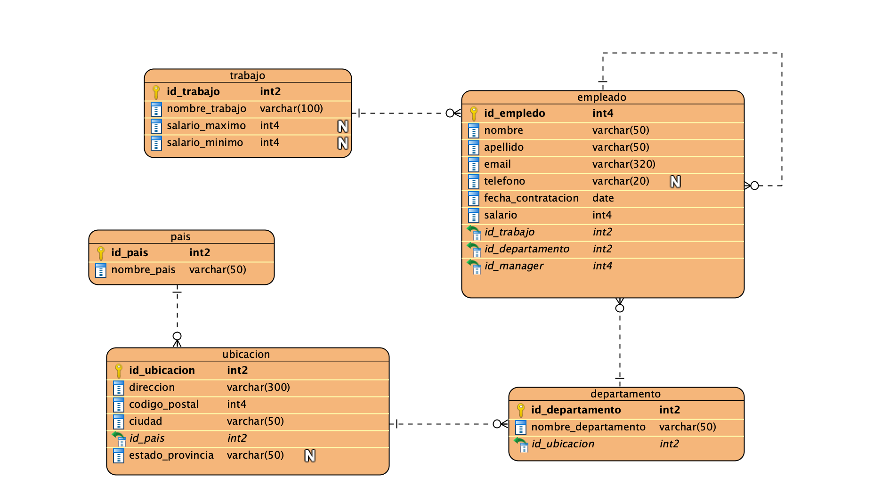

# DQL Básico y DML  

El propósito de esta clase es introducir a los estudiantes a los fundamentos de **DQL** (Data Query Language) y **DML** (Data Manipulation Language).  

---

## 🕰️ Recordemos...  

### **DQL – Data Query Language (Lenguaje de Consulta de Datos)**  
El Lenguaje de Consulta de Datos (DQL) incluye instrucciones diseñadas para recuperar datos almacenados en bases de datos relacionales. El comando más representativo de este lenguaje es `SELECT`, que permite filtrar y devolver resultados específicos de una tabla SQL.  

### **DML – Data Manipulation Language (Lenguaje de Manipulación de Datos)**  
El Lenguaje de Manipulación de Datos (DML) incluye comandos que permiten agregar, modificar o eliminar datos en una base de datos relacional. Por ejemplo, el comando `INSERT` se utiliza para almacenar un nuevo registro, mientras que `UPDATE` y `DELETE` modifican o eliminan datos existentes, respectivamente.  

---

## Preparación de la Estructura para la Clase  

Para esta sesión, partiremos de la siguiente estructura de base de datos. Esto nos permitirá trabajar con los comandos de DQL y DML. 
Para esto, iniciaremos creando las tablas usando lo aprendido en la clase anterior. 

  

### Scripts para crear la estructura
```sql
-- Crear tabla trabajo
CREATE TABLE trabajo (
	id_trabajo SMALLSERIAL PRIMARY KEY,
	nombre_trabajo VARCHAR(100) NOT NULL,
	salario_maximo INT,
	salario_minimo INT
);
-- Crear tabla pais
CREATE TABLE pais(
	id_pais SMALLSERIAL PRIMARY KEY,
	nombre_pais VARCHAR(50) NOT NULL
);

-- Crear tabla ubicación
CREATE TABLE ubicacion(
	id_ubicacion SMALLSERIAL PRIMARY KEY,
	direccion VARCHAR(300) NOT NULL,
	codigo_postal INT NOT NULL,
	ciudad VARCHAR(50) NOT NULL,
	estado_provincia VARCHAR(50),
	id_pais SMALLINT NOT NULL,
	CONSTRAINT fk_pais FOREIGN KEY (id_pais) REFERENCES pais (id_pais)
);

-- Crear tabla departamento
CREATE TABLE departamento (
	id_departamento SMALLSERIAL PRIMARY KEY,
	nombre_departamento VARCHAR(50) NOT NULL,
	id_ubicacion SMALLINT NOT NULL,
	CONSTRAINT fk_ubicacion FOREIGN KEY (id_ubicacion) REFERENCES ubicacion (id_ubicacion)
);

-- Crear tabla empleado
CREATE TABLE empleado (
 	id_empleado SERIAL PRIMARY KEY,
	nombre VARCHAR(50) NOT NULL,
	apellido VARCHAR(50) NOT NULL,
	email VARCHAR(320) NOT NULL UNIQUE,
	telefono VARCHAR(20),
	fecha_contratacion DATE,
	salario INT NOT NULL,
	id_trabajo SMALLINT NOT NULL,
	id_departamento SMALLINT NOT NULL,
	id_manager INT,
	CONSTRAINT fk_trabajo FOREIGN KEY (id_trabajo) REFERENCES trabajo (id_trabajo),
	CONSTRAINT fk_departamento FOREIGN KEY (id_departamento) REFERENCES departamento (id_departamento),
	CONSTRAINT fk_manager FOREIGN KEY (id_manager) REFERENCES empleado (id_empleado)
 );
 
-- AGREGAR valores por defecto
-- FECHA CONTRATACION
ALTER TABLE empleado
ALTER COLUMN fecha_contratacion SET DEFAULT NOW();

-- Nombre trabajo
ALTER TABLE trabajo
ALTER COLUMN nombre_trabajo SET DEFAULT '';

-- CHECK salarios
-- FORMA 1
ALTER TABLE trabajo
ADD CONSTRAINT check_salario_minimo CHECK (salario_minimo > 0),
ADD CONSTRAINT check_salario_maximo CHECK (salario_maximo > 0);

-- FORMA 2
ALTER TABLE trabajo
ADD CONSTRAINT check_salarios CHECK (salario_minimo > 0 AND salario_maximo > 0);

-- Check salario empleado
ALTER TABLE empleado
ADD CONSTRAINT check_salario CHECK (salario > 0);
```

**Detalles importantes a considerar al momento de crear las tablas:**  
1. Todos los IDs son autoincrementales.  
2. Algunos IDs tienen el tipo de dato `SMALLSERIAL`
3. La columna `email` en la tabla `empleado` y `nombre_pais` en la tabla `pais` deben ser únicas (`UNIQUE`).  
4. El valor por defecto de la columna `fecha_contratacion` en la tabla `empleado` debe ser la fecha actual. Usar `ALTER`. 
5. El valor por defecto de la columna `nombre_trabajo` en la tabla `trabajo` debe ser una cadena vacía (`''`). Usar `ALTER`.  
6. Las columnas `salario` en las tablas `trabajo` y `empleado` deben contener siempre valores positivos. Usar `ALTER`.

---

## **INSERT**  
El comando `INSERT` permite agregar datos a una tabla en una base de datos. Es una de las instrucciones clave del lenguaje DML y ofrece las siguientes opciones:  
1. Insertar una sola fila en una tabla.  
2. Insertar múltiples filas en una tabla.  
3. Copiar filas de una tabla a otra.  

---

### **Insertar una fila en una tabla**  
#### Sintaxis  
```sql
INSERT INTO tabla (columna1, columna2, ...)
VALUES (valor1, valor2, ...);
```
**Detalles importantes:**
1. El número de columnas especificadas debe coincidir con el número de valores proporcionados.
2. Antes de agregar un nuevo registro, el sistema verifica las restricciones de integridad, como claves foráneas (FK), claves primarias (PK), restricciones `CHECK` y `NOT NULL`. Si alguna de estas restricciones falla, la base de datos emitirá un error y no insertará la fila.
3. Si no se especifica un valor para una columna, se utilizará su valor por defecto definido en la estructura de la tabla. Este valor puede ser una cadena, un número, una fecha, o incluso un valor `NULL`.
4. Si la fila se inserta correctamente, la base de datos devuelve el número de filas afectadas, por ejemplo: `Filas afectadas: 1`.

**Ejemplo: Insertar una fila en la tabla `trabajo`**
```sql
INSERT INTO trabajo (nombre_trabajo, salario_minimo, salario_maximo) 
VALUES ('Desarrollador de Software', 3000000, 12000000);
```

---

### Insertar múltiples filas
#### Sintaxis
```sql
INSERT INTO tabla (columna1, columna2, ...)
VALUES 
    (valor1_1, valor2_1, ...), 
    (valor1_2, valor2_2, ...), 
    (valor1_3, valor2_3, ...);
```

**Ejemplo: Insertar múltiples filas en la tabla `trabajo`**
```sql
INSERT INTO trabajo 
  (nombre_trabajo, salario_minimo, salario_maximo) 
VALUES 
  ('Científico de Datos', 5000000, 15000000),
  ('Director de Operaciones', 4000000, 8000000),
  (DEFAULT, 1300000, 1700000);
```
Aquí se agregan tres registros a la tabla `trabajo`. Se utiliza `DEFAULT` para que la columna `nombre_trabajo` tome automáticamente el valor por defecto `''`.

---

### Insertar datos desde otra tabla
#### Sintaxis
```sql
INSERT INTO tabla_destino (columna1, columna2, ...)
SELECT columna1, columna2, ...
FROM tabla_origen
WHERE condicion;
```

**Ejemplo: Copiar datos de la tabla `trabajo` a `historico_trabajos`**
```sql
INSERT INTO historico_trabajo (nombre_trabajo, salario_minimo, salario_maximo)
SELECT nombre_trabajo, salario_minimo, salario_maximo
FROM trabajo;
```
Este comando copia todos los registros de la tabla `trabajo` a la tabla `historico_trabajos`.

---

## **UPDATE**
Para modificar los datos existente en una tabla puedes usar el comando `UPDATE`.
#### Sintaxis  
```sql
UPDATE tabla
SET
  columna1 = valor1,
  columna2 = valor3
[WHERE Condición];
```

**Detalles importantes:**

En esta sintaxis:

1. Indica la tabla que deseas actualizar en la cláusula `UPDATE`.
2. Especifica las columnas a modificar en la cláusula `SET`. Las columnas que no se mencionen en la cláusula `SET` conservarán sus valores originales.
3. Especifica qué filas deseas actualizar en la cláusula `WHERE`. Cualquier fila que cumpla con la condición definida en el `WHERE` será modificada.
4. La cláusula `WHERE` es opcional. Por lo tanto, si la omites, **TODAS LAS FILAS DE LA TABLA SERáN AFECTADAS**.

---

> Antes de continuar vamos a insertar algunos datos en las otras tablas, para esto por favor correr el siguiente script:
```SQL
-- INSERTAR DATOS EN LA TABLA pais
INSERT INTO pais (nombre_pais)
VALUES
  ('Colombia'),
  ('Estados Unidos'),
  ('México'),
  ('España'),
  ('Argentina');

-- INSERTAR DATOS EN LA TABLA ubicacion
INSERT INTO ubicacion (direccion, codigo_postal, ciudad, estado_provincia, id_pais)
VALUES
  ('Calle 123 #45-67', 110111, 'Bogotá', 'Cundinamarca', 1),
  ('123 Main St', 90210, 'Los Ángeles', 'California', 2),
  ('Avenida Reforma 456', 77500, 'Cancún', 'Quintana Roo', 3),
  ('Calle Mayor 10', 28013, 'Madrid', NULL, 4),
  ('Avenida Córdoba 789', 5000, 'Córdoba', NULL, 5);

-- INSERTAR DATOS EN LA TABLA departamento
INSERT INTO departamento (nombre_departamento, id_ubicacion)
VALUES
  ('Desarrollo de Software', 1),
  ('Recursos Humanos', 2),
  ('Marketing', 3),
  ('Atención al Cliente', 4),
  ('Operaciones', 5);

-- INSERTAR DATOS EN LA TABLA empleado
INSERT INTO empleado (nombre, apellido, email, telefono, fecha_contratacion, salario, id_trabajo, id_departamento, id_manager)
VALUES
  ('Juan', 'Pérez', 'juan.perez@email.com', '3001234567', DEFAULT, 4000000, 1, 1, NULL),
  ('Ana', 'Martínez', 'ana.martinez@email.com', '3009876543', DEFAULT, 5000000, 2, 2, 1),
  ('Carlos', 'Gómez', 'carlos.gomez@email.com', '3004567890', DEFAULT, 4500000, 3, 3, 1),
  ('Luisa', 'Fernández', 'luisa.fernandez@email.com', '3008765432', DEFAULT, 6000000, 1, 4, 2),
  ('Sofía', 'López', 'sofia.lopez@email.com', '3005432198', DEFAULT, 3500000, 2, 5, 3);

```
---

### **Actualizar una fila en una tabla**

**Ejemplo: En el siguiente ejemplo vamos a actualizar el nombre del empleado con `id_empleado=1`, el empleado actualmente se llama Juan en la base de datos pero vamos a cambiarle el nombre a Pedro**

```sql
UPDATE empleado
SET
 nombre = 'Pedro'
WHERE
 id_empleado = 1;
```

Verificar que la actualización se haya realizado con la siguiente consulta:
```sql
SELECT * 
FROM empleado 
WHERE id_empleado = 1;
```
---
### **Actualización de varias filas**
**Ejemplo: Vamos a actualizar la fecha de contratación de los empleados con `id_manager = 1`**
```sql
UPDATE empleado
SET fecha_contratacion = '2025-01-26'
WHERE id_manager = 1;
```
---
### Actualizar con un subquery
**Ejemplo: Aumentar 5% el salario de los empleados cuyo departamento es 'Recursos Humanos`**
```sql
UPDATE empleado
SET salario = salario * 1.05 -- Aumentar en un 5%
WHERE id_departamento = (
    SELECT id_departamento
    FROM departamento
    WHERE nombre_departamento = 'Recursos Humanos'
);
```

---

## **DELETE**
Para eliminar una o más filas de una tabla, puedes utilizar la instrucción `DELETE`.

#### Sintaxis  
```sql
DELETE
FROM
 tabla
[WHERE condición];
```

**Detalles importantes:**
En esta sintaxis:
1. Especifica el nombre de la tabla de la cual deseas eliminar filas.
2. Define la condición en la cláusula `WHERE` para identificar las filas que deben ser eliminadas.
3. ⚠ Precaución: Si se omite la cláusula `WHERE`, todas las filas de la tabla serán eliminadas.
4. La sentencia `DELETE` devuelve el número de filas eliminadas.
---
### **Eliminar una fila en una tabla**
**Ejemplo: Vamos a borrar la fila  con id_empleado = 4 en la tabla `empleado`**
```sql
DELETE 
FROM empleado
WHERE id_empleado = 4;
```

Puedes verificar que la fila con `id_empleado = 4` fue borrada con esta consulta:
```sql
SELECT * 
FROM empleado
WHERE id_empleado = 4; 
```
---
### **Eliminar multiples filas**
Para eliminar múltiples filas en una tabla, se utiliza la condición en la cláusula `WHERE` para identificar las filas que deben ser eliminadas. Por ejemplo, la siguiente sentencia utiliza el operador `IN` para eliminar empleados con ciertos `id_empleado`:
```sql
DELETE FROM empleado
WHERE id_empleado IN (3, 5, 7);
```
---
### Eliminar filas de tablas relacionadas

Cuando necesitas eliminar filas de tablas relacionadas, debes asegurarte de mantener la integridad referencial. Esto puede lograrse configurando acciones como `ON DELETE CASCADE` en las claves foráneas o eliminando manualmente los registros en un orden específico.

#### Eliminación manual de registros relacionados

Supongamos que tienes las tablas `departamento` y `empleado`, donde `empleado` tiene una clave foránea `id_departamento` que hace referencia a la tabla `departamento`. Si deseas eliminar un departamento y todos los empleados relacionados, puedes hacerlo manualmente de la siguiente manera:

```sql
-- Primero elimina las filas relacionadas de la tabla empleado
DELETE FROM empleado
WHERE id_departamento = 2;

-- Luego elimina el departamento correspondiente
DELETE FROM departamento
WHERE id_departamento = 2;
```

#### Uso de ON DELETE CASCADE
Si la clave foránea en la tabla empleado está configurada con `ON DELETE CASCADE`, los registros relacionados en `empleado` se eliminarán automáticamente al eliminar un registro en `departamento`.

```sql
-- Configuración de la clave foránea con ON DELETE CASCADE
-- Primero borramos la constraint actual
ALTER TABLE empleado
DROP CONSTRAINT fk_departamento;

-- Luego la volvemos a agregar con la configuración de ON DELETE CASCADE
ALTER TABLE empleado
ADD CONSTRAINT fk_departamento FOREIGN KEY (id_departamento)
REFERENCES departamento (id_departamento)
ON DELETE CASCADE;

-- Ahora, al eliminar un departamento, los empleados relacionados se eliminan automáticamente
DELETE FROM departamento
WHERE id_departamento = 2;
```
---
#### Otras restricciones ON DELETE en SQL
Las restricciones `ON DELETE` definen qué sucede con los registros en una tabla hija cuando el registro en la tabla padre es eliminado:
| Restricción      | Descripción |
|------------------|-------------|
| **CASCADE**      | Elimina automáticamente los registros relacionados en la tabla hija. |
| **SET NULL**     | Establece la clave foránea en `NULL` en la tabla hija. |
| **RESTRICT**     | Impide la eliminación si hay registros relacionados. (**Comportamiento por defecto**) |
| **NO ACTION**    | Igual que `RESTRICT`, pero evalúa la restricción al final de la transacción. |
| **SET DEFAULT**  | Asigna un valor por defecto a la clave foránea en la tabla hija. |

Para más información acceder al siguiente [enlace](https://es.stackoverflow.com/questions/105890/qu%C3%A9-significa-cascade-set-null-restrict-no-action-en-mysql).

> Para la siguiente sección, insertar más registros a las tablas existentes.

---

## DQL Básico
El lenguaje de consulta de datos, como se ha mencionado anteriormente, incluye instrucciones diseñadas para recuperar datos almacenados en bases de datos relacionales. Para esto, se hace uso del comando `SELECT`. 

### SELECT
Con el comando `SELECT` en SQL, los usuarios pueden acceder a datos y recuperar registros específicos en función de diversas condiciones, lo que lo convierte en una herramienta **esencial** para administrar y analizar datos.

#### Sintaxis básica
```sql
SELECT A1, A2, ...
 FROM r1, r2, ...
 WHERE P;
```
Donde:
- `Ai` son atributos (columnas).
- `ri` son relaciones (tablas).
- `P` es el predicado de selección (filas).

#### 📌 Detalles importantes sobre `SELECT`

- Los nombres de las columnas que aparecen después de la palabra clave `SELECT` determinan qué columnas se mostrarán en los resultados. Puedes seleccionar tantas columnas como desees o usar `*` para seleccionar todas las columnas. *(No es una buena práctica usar `*`, más adelante veremos por qué).*
- El nombre de la tabla que sigue a la palabra clave `FROM` especifica la tabla de donde se obtendrán los datos.
- La cláusula `WHERE` (opcional) permite filtrar los resultados y devolver únicamente aquellas filas que cumplan con la condición especificada después de `WHERE`.

**🔍 Operadores condicionales en la cláusula `WHERE`**
| Operador | Descripción |
|----------|------------|
| `=`      | Igual a |
| `>`      | Mayor que |
| `<`      | Menor que |
| `>=`     | Mayor o igual que |
| `<=`     | Menor o igual que |
| `<>`     | Diferente de (también puede usarse `!=`) |
| `LIKE`   | *Utilizado para buscar coincidencias de patrones en cadenas de texto* |

#### 🔍 Uso del operador `LIKE` en SQL

El operador `LIKE` permite realizar búsquedas basadas en patrones dentro de la cláusula `WHERE`. Es una herramienta muy poderosa que filtra filas que coincidan parcialmente con el criterio especificado.

### 🎯 **Uso de comodines en `LIKE`**
El símbolo de porcentaje (`%`) actúa como un **comodín**, representando cualquier secuencia de caracteres antes o después del valor indicado.

### 📝 **Ejemplo**
En la siguiente consulta, se seleccionarán todos los empleados cuyo apellido termine en `"ez"`:

```sql
SELECT 
  id_empleado, 
  nombre, 
  apellido, 
  email, 
  telefono, 
  fecha_contratacion, 
  salario
FROM empleado
WHERE apellido LIKE '%ez';llido LIKE '%ez'; 
```
**🔹 Explicación:**

- El `%` antes de "ez" significa que pueden existir cualquier cantidad de caracteres antes de "ez".
- Se seleccionarán empleados con apellidos como "Gómez", "Martínez", "Hernández", etc.

**💡 Nota: También puedes usar el guion bajo (_) como comodín para representar un solo carácter.**
```SQL
WHERE nombre LIKE '_uan'; -- Coincide con "Juan", "Luán", etc.
```

---

### Equivalencia del comando `SELECT` con el álgebra relacional
El comando `SELECT` en SQL tiene su equivalente en operaciones del **álgebra relacional**:

- **Selección de columnas**  
  ```sql
  SELECT A1, A2, ...  
  ```
  Equivale a la operación de proyección (`Π`) en álgebra relacional:
  ```
  Π(A1, A2, …)
  ```
- **Selección de tablas**
  ```sql
  FROM r1, r2, ...
  ```
  Representa un producto cartesiano (×) entre las tablas: 
  ```
  r1 × r2 × …
  ```
- **Filtrado de filas**
  ```sql
  WHERE P
  ```
  Es equivalente a la selección en álgebra relacional:
  ```
  σP(…)
  ```
- **Estructura completa**
  ```SQL
  SELECT A1, A2, ... FROM r1, r2, ... WHERE P;
  ```
  Se representa en álgebra relacional como:
  ```
  Π(A1, A2, …) (σP(r1 × r2 × …))
  ```
  Es decir, primero se combinan las tablas con un producto cartesiano, luego se filtran las filas con la selección, y finalmente se eligen las columnas con la proyección.

**Ejemplo usando [RelaX](https://dbis-uibk.github.io/relax/calc/local/uibk/local/0)**
- Cargar el siguiente [dataset](ejemplos%2FClase%20-%20DQL%20b%C3%A1sico%20y%20DML%2Frelax.txt) a RelaX que corresponde al mismo dataset que hemos venido trabajando.
Ejecutar los siguientes queries:
 - Query 1:
    ```sql
    SELECT id_empleado, nombre, apellido
    FROM empleado
    WHERE id_empleado = 1
    ```
    El resultado convertido al algebra relacional según RelaX es:
    ```
    π id_empleado, nombre, apellido σ id_empleado = 1 empleado
    ```
- Query 2:
    ```SQL
    SELECT nombre, apellido, email
    FROM empleado
    WHERE id_manager IS NULL
    ```
    El resultado convertido al algebra relacional según RelaX es:
    ```
    π nombre, apellido, email σ id_manager = null empleado
    ```

> Seguir practicando usando RelaX.


## Ejercicios en clase
### 📝 **Ejercicios en Clase: DQL y DML**
**1. INSERT**
- Inserta 3 países adicionales en la tabla `pais`.
- Agrega nuevas ubicaciones asociadas a los países que acabas de insertar.
- Añade un departamento nuevo en una de las ubicaciones creadas llamado `Investigación y Desarrollo`.
- Agrega dos nuevos empleados al departamento recién creado. Uno de ellos llamado Gabriel Santos y el otro llamado Fernanda Rojas.

**2. UPDATE**
- Aumenta el salario de `Fernanda Rojas` en un 10%.
- Cambia la ubicación del departamento `Investigación y Desarrollo` a una de las nuevas ubicaciones.
- Cambia el cargo de `Gabriel Santos` a "Jefe de Desarrollo" con un aumento de 15%.

**3. DELETE**
- Elimina a `Gabriel Santos` de la base de datos.
- Elimina a todos los empleados del departamento `Investigación y Desarrollo`.
- Intenta eliminar el departamento `Investigación y Desarrollo`, si no hay empleados en él.

**4. SELECT**
- Consulta todos los empleados de la empresa.
- Muestra los empleados del departamento de `Marketing`.
- Consulta los empleados con salario mayor a 5,000,000.
- Busca empleados cuyo apellido termine contenga "pe".
- Obtén la información de empleados sin manager.

**5. Desafío adicional (opcional)**
- Crea una consulta que muestre el `nombre`, `apellido`, `salario` y el `nombre del departamento` de cada empleado.

### SEGUIR PRACTICANDO....
Algunos links para practicar:
- https://www.sql-practice.com/
- https://www.sqlcourse.com/beginner-course/selecting-data/

## Bibliografía
- Silberschatz, A., Korth, H. F., & Sudarshan, S. (2019). Database System Concepts (7th ed.). McGraw Hill Education.
- https://dbs.academy.lv/lection/dbs_LS10EN_sql-dml.pdf
- https://www.sqlcourse.com/advanced-course/select-statement/
