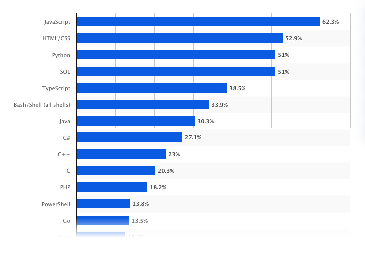

# Introducción a SQL y DDL

En esta clase estudiaremos el lenguaje más usado para interactuar con bases de datos: **SQL**.

Aunque SQL es conocido como un "lenguaje de consultas", puede realizar muchas más tareas además de consultar datos. Este lenguaje permite definir la estructura de los datos, modificar los datos almacenados en las bases de datos y establecer restricciones de seguridad.

## ¿Qué es SQL?

**SQL** (Structured Query Language) es un lenguaje de programación diseñado para trabajar con bases de datos relacionales. Está basado en los principios de la **álgebra relacional** y el **cálculo relacional de tuplas**. SQL viene integrado como parte de los principales sistemas de gestión de bases de datos relacionales (RDBMS).

## Un poco de historia

SQL fue introducido en la década de 1970 por los científicos de IBM **Donald Chamberlin** y **Raymond Boyce**. Inicialmente se llamaba **Structured English Query Language (SEQUEL)** antes de ser abreviado como SQL. Este lenguaje fue diseñado a partir del concepto de modelos relacionales de Edgar Codd.

En 1977 se lanza la primera base de datos relacional conocida como (System R)[https://people.eecs.berkeley.edu/~brewer/cs262/SystemR.pdf] que a su vez introduce el lenguaje SQL. El nombre del lenguaje se acortó a SQL (pero aún se pronuncia “sequel”) debido a un problema de derechos de autor. 

SQL se comercializó por primera vez en 1979 por Oracle (en esa época la empresa no se llamaba Oracle sino Relational Software) y rápidamente se convirtió en el estándar mundial para los sistemas de gestión de bases de datos relacionales (RDBMS). Fue estandarizado por el **American National Standards Institute (ANSI)** en 1986 y por la **International Organization for Standardization (ISO)** en 1987.

La mayoría de los proveedores de bases de datos relacionales siguen la última versión del estándar, que, al momento de escribir este artículo, es [ISO/IEC 9075-1:2023](https://cdn.standards.iteh.ai/samples/76583/937e2166ff594619a4fc86cdde8cade3/ISO-IEC-9075-1-2023.pdf).

---

## SQL hoy en día
SQL está entre los lenguajes de programación más usados y demandados a nivel mundial.


Fuente: https://www.statista.com/statistics/793628/worldwide-developer-survey-most-used-languages/

---

### ¿SQL es un estándar?

Aunque SQL es un estándar ANSI/ISO, existen distintas versiones y dialectos del lenguaje. Sin embargo, para cumplir con el estándar, todas las versiones soportan al menos los comandos principales, como **SELECT**, **UPDATE**, **DELETE**, **INSERT** y **WHERE**. Algunos sistemas, como **T-SQL** para Microsoft SQL Server y **PL/SQL** para Oracle, incluyen extensiones propietarias para necesidades específicas, pero respetan los comandos básicos del estándar.

---

### Ejemplos de tareas realizadas con SQL:
- Crear, modificar y eliminar tablas de bases de datos.
- Insertar, actualizar y eliminar datos.
- Recuperar datos mediante sentencias **SELECT**.
- Agrupar y realizar cálculos agregados sobre los datos.
- Unir datos de múltiples tablas.
- Crear vistas y procedimientos almacenados.
- Realizar análisis y minería de datos.
- Gestionar la seguridad y permisos de la base de datos.
- Monitorear y optimizar el rendimiento de la base de datos.
- Respaldar y restaurar bases de datos.

---

## Comandos SQL

Los comandos de **SQL** son palabras clave o sentencias específicas que los desarrolladores utilizan para interactuar con los datos de una base de datos relacional. Estos comandos se clasifican en las siguientes categorías:

### 1. **DDL – Data Definition Language (Lenguaje de Definición de Datos)**
El lenguaje de definición de datos (DDL) se refiere a los comandos SQL que diseñan la estructura de la base de datos. Los ingenieros de bases de datos utilizan DDL para crear y modificar objetos de bases de datos según los requisitos empresariales. Por ejemplo, el ingeniero de bases de datos utiliza el comando CREATE para crear objetos de bases de datos como tablas, vistas e índices.

### 2. **DQL – Data Query Language (Lenguaje de Consulta de Datos)**
El lenguaje de consulta de datos (DQL) consta de instrucciones para recuperar datos almacenados en bases de datos relacionales. Las aplicaciones de software utilizan el comando SELECT para filtrar y devolver resultados específicos de una tabla SQL.

### 3. **DML – Data Manipulation Language (Lenguaje de Manipulación de Datos)**
Las instrucciones del lenguaje de manipulación de datos (DML) escriben nueva información o modifican registros existentes en una base de datos relacional. Por ejemplo, una aplicación utiliza el comando INSERT para almacenar un nuevo registro en la base de datos.

### 4. **DCL – Data Control Language (Lenguaje de Control de Datos)**
Los administradores de bases de datos utilizan el lenguaje de control de datos (DCL) para administrar o autorizar el acceso a la base de datos a otros usuarios. Por ejemplo, pueden utilizar el comando GRANT para permitir que ciertas aplicaciones manipulen una o más tablas.

### 5. **TCL – Transaction Control Language (Lenguaje de Control de Transacciones)**
El motor relacional utiliza el lenguaje de control de transacciones (TCL) para realizar cambios en la base de datos de forma automática. Por ejemplo, la base de datos utiliza el comando ROLLBACK para deshacer una transacción errónea.


---

## Sintaxis de SQL

SQL es un lenguaje declarativo, por lo que su sintaxis se asemeja a un lenguaje natural. Una sentencia SQL comienza con un verbo que describe la acción, como **SELECT**, **INSERT**, **UPDATE** o **DELETE**. Después del verbo, se especifican el sujeto y el predicado. El predicado define condiciones que pueden evaluarse como verdadero, falso o desconocido.

### Ejemplo de sintaxis básica
```sql
-- Obtener empleados que ingresaron a la empresa en el año 2000
SELECT
  first_name
FROM 
  employees
WHERE
  YEAR(hire_date) = 2000;
```

En este ejemplo:

- `SELECT`, `FROM`, y `WHERE` son cláusulas de la sentencia SQL.
- Algunas cláusulas son obligatorias (como `SELECT` y `FROM`), mientras que otras son opcionales (como `WHERE`).

### Sintaxis de los comandos SQL
SQL está compuesto por comandos que terminan con un punto y coma (;). Por ejemplo, las siguientes son dos sentencias SQL independientes:

```sql
SELECT
  first_name, last_name
FROM
  employees;

DELETE FROM employees
WHERE
  hire_date < '1990-01-01';
```
Cada comando está compuesto por tokens, que pueden ser literales, palabras clave, identificadores o expresiones. Los tokens están separados por espacios, tabulaciones o saltos de línea.

### Literales
Los literales son valores explícitos que también se conocen como constantes. SQL proporciona tres tipos principales de literales: cadenas de texto, números y valores binarios.

#### Literales de texto
Consisten en uno o más caracteres alfanuméricos rodeados por comillas simples. Ejemplos:
```sql
'John'
'1990-01-01'
'50'
''
```
Aunque `50` es un número, si se rodea con comillas simples (por ejemplo, '50'), SQL lo trata como una cadena de texto.

#### Literales numéricos
Pueden ser números enteros, decimales o en notación científica. Ejemplos:
```sql
200
-5
6.0221415E23
```

#### Literales binarios
SQL representa valores binarios con la notación x'0000', donde cada dígito es un valor hexadecimal. Ejemplos:
```sql
x'01'
x'0f0ff'
```

### Palabras clave
SQL tiene muchas palabras clave con significados específicos, como `SELECT`, `INSERT`, `UPDATE`, `DELETE`, `DROP`, `WHERE`, `FROM`, `SET`, `VIEW`, `TABLE`, `INT`, `VARCHAR`, `BETWEEN`, `NULL`, entre otras.

Estas palabras clave están reservadas y no se pueden usar como nombres para tablas, columnas, índices, vistas, procedimientos almacenados u otros objetos de la base de datos.

Puedes consultar una lista completa de palabras reservadas en [W3Schools](https://www.w3schools.com/sql/sql_ref_keywords.asp).

### Identificadores
Los identificadores se refieren a objetos específicos dentro de la base de datos, como tablas, columnas o índices. SQL no distingue entre mayúsculas y minúsculas para palabras clave e identificadores, por lo que las siguientes sentencias son equivalentes:

```sql
SELECT * FROM employees;
select * from EMPLOYEES;
Select * From employees;
```
Para mantener las sentencias SQL más legibles, se recomienda usar:
- Palabras clave en mayúsculas.
- Identificadores en minúsculas.

### Comentarios
Los comentarios en SQL se usan para documentar el código. El motor de la base de datos ignora cualquier texto que se encuentre en un comentario.

#### Comentarios de una sola línea
Se indican con dos guiones consecutivos (--). Ejemplo:
```sql
SELECT
  employee_id, salary
FROM
  employees
WHERE
  salary < 3000; -- empleados con salario bajo
```

#### Comentarios de varias líneas
Se indican con la notación de estilo C (/* ... */). Ejemplo:
```sql
/* Incrementar un 5% el salario
de los empleados cuyo salario sea menor a 3000 */
UPDATE employees
SET
  salary = salary * 1.05
WHERE
  salary < 3000;
```

### Mejores prácticas y resumen
1. SQL no distingue entre mayúsculas y minúsculas en los comandos (excepto en los valores de cadenas de texto).
2.  Es una buena práctica escribir:
    - Palabras clave en mayúsculas. Ejemplo: SELECT, FROM, WHERE.
    - Identificadores (como nombres de tablas o columnas) en minúsculas.
3. Las reglas para nombres de identificadores incluyen:
    - El primer carácter debe ser una letra.
    - Los caracteres restantes pueden ser alfanuméricos o un guión bajo (_).
4. Finaliza todos tus comandos con un punto y coma `;`.
5. Evita usar espacios en esquemas, tablas o nombrs de campos. Usa guiones bajo para separar esquemas, tablas o nombres de campos.
6. Los caracteres y cadenas de texto se encierran en comillas simples 'A', '2', 'line', 'other line'
7. Un comentario de una línea inicia con `--`
8. Un comentario de varios líneas se encierra en `/ * ... * /`

---

## DDL - Lenguaje de manipulación de datos
Los comandos del Lenguaje de Definición de Datos (DDL) me permiten definir y gestionar un esquema en SQL. En pocas palabras, un esquema en SQL es un plano que define cómo se organizan los datos en una base de datos y cómo se gestionan las relaciones entre las distintas tablas de la base de datos.

| **Comando DDL** | **DESCRIPCIÓN**                                                      | **Sintaxis**        |
|------------------|----------------------------------------------------------------------|--------------------|
| CREATE           | Crea una tabla y sus columnas junto con su tipo de datos.           | `CREATE TABLE`       |
| ALTER            | Modifica los nombres de las columnas y añade o elimina una columna. | `ALTER TABLE`        |
| RENAME           | Cambia el nombre de la tabla.                                       | `RENAME TABLE`       |
| TRUNCATE         | Elimina datos de una tabla sin borrar la tabla.                     | `TRUNCATE TABLE`     |
| DROP             | Elimina la tabla con sus datos.                                     | `DROP TABLE`         |

### CREATE
El comando `CREATE` se utiliza para crear objetos en la base de datos, como tablas, vistas, índices, esquemas, bases de datos etc.

La estructura básica del comando es:
```sql
CREATE TABLE nombre_tabla (
  nombre_columna tipo_dato [constraint],
  ...
);
```
Constraint es opcional, sino se específica se asume que el campo es NULLable.

Ejemplo básico:
```sql
CREATE TABLE empleados (
  id_empleado integer,
  nombre VARCHAR(50),
  correo VARCHAR(100)
  departamento,
  salario DECIMAL(10, 2)
);
```

Recuerda los tipos de datos de PostgreSQL disponibles [aquí](https://www.postgresql.org/docs/8.1/datatype.htm).

### Constraints
Los **constraints** (restricciones) son reglas que se aplican a los datos en una tabla para garantizar su integridad y validez. Estas restricciones ayudan a proteger los datos y evitar errores como duplicados, valores nulos, relaciones inválidas, entre otros.

### Tipos de constraints

Los constraints se dividen en dos categorías principales:

1. **Column constraints**: Se aplican directamente a una columna específica.
2. **Table constraints**: Se aplican a una o más columnas de la tabla.

### Principales constraints en SQL

A continuación, se describen los constraints más comunes y su propósito:

#### 1. `NOT NULL`
Garantiza que una columna no pueda contener valores nulos. Es útil para campos obligatorios.
```sql
CREATE TABLE empleados (
  id_empleado SERIAL PRIMARY KEY,
  nombre VARCHAR(50) NOT NULL,
  departamento VARCHAR(50)
);
```

#### 2. `UNIQUE`
Impide que una columna tenga valores duplicados.
```sql
CREATE TABLE usuarios (
  id_usuario SERIAL PRIMARY KEY,
  correo VARCHAR(100) UNIQUE
);
```

#### 3. `PRIMARY KEY`
Combina las restricciones `NOT NULL` y `UNIQUE`. Se utiliza para identificar de manera única cada fila en una tabla.
```SQL
CREATE TABLE clientes (
  id_cliente SERIAL PRIMARY KEY,
  nombre VARCHAR(100) NOT NULL
);
```

#### 4. `FOREIGN KEY`
Garantiza que el valor de una columna coincida con el valor de una columna en otra tabla (relación entre tablas).

```SQL
CREATE TABLE pedidos (
  id_pedido SERIAL PRIMARY KEY,
  id_cliente INT NOT NULL,
  FOREIGN KEY (id_cliente) REFERENCES clientes (id_cliente)
);
```

#### 5. `CHECK`
Restringe los valores de una columna según una condición lógica.
```SQL
CREATE TABLE productos (
  id_producto SERIAL PRIMARY KEY,
  precio DECIMAL(10, 2) CHECK (precio > 0)
);
```

#### 6. `EXCLUDE`
Evita que dos filas tengan valores conflictivos en una o más columnas, usando operadores específicos. Es común en PostgreSQL.
```SQL
CREATE TABLE reservas_habitaciones (
    id_habitacion integer,
    reservado_desde timestamptz,
    reservado_hasta timestamptz,
    cancelado boolean DEFAULT false,
    EXCLUDE USING gist (
        id_habitacion WITH =, 
        tstzrange(reservado_desde, reservado_hasta) WITH &&
    ) WHERE (NOT cancelado)
);
```

#### 7. `REFERENCES`
Especifica una relación con una clave primaria o única en otra tabla (es equivalente a `FOREIGN KEY`).
```SQL
CREATE TABLE facturas (
  id_factura SERIAL PRIMARY KEY,
  id_cliente INT REFERENCES clientes (id_cliente)
);
```

### `SERIAL` y `SEQUENCE` en PostgreSQL
En PostgreSQL, el tipo de dato `SERIAL` se utiliza para generar valores únicos incrementales automáticamente. Es común usarlo para columnas de claves primarias.

Cuando defines una columna como `SERIAL`:
- Se crea automáticamente una secuencia asociada.
- La secuencia genera valores únicos para cada fila nueva.
Ejemplo:
```sql
CREATE TABLE productos (
  id_producto SERIAL PRIMARY KEY,
  nombre VARCHAR(100) NOT NULL
);
```

Equivalente a:
```sql
CREATE SEQUENCE productos_id_producto_seq;

CREATE TABLE productos (
  id_producto INT NOT NULL DEFAULT nextval('productos_id_producto_seq'),
  nombre VARCHAR(100) NOT NULL,
  PRIMARY KEY (id_producto)
);
```

#### Uso de secuencias (`SEQUENCE`) directamente
Si necesitas un mayor control sobre los valores generados, puedes usar una secuencia explícitamente:

```sql
CREATE SEQUENCE ordenes_id_seq START 1000 INCREMENT 10;

CREATE TABLE ordenes (
  id_orden INT DEFAULT nextval('ordenes_id_seq') PRIMARY KEY,
  descripcion VARCHAR(255)
);
```

### ALTER
El comando **`ALTER`** se utiliza para modificar la estructura de una tabla existente. Permite agregar, modificar o eliminar columnas, así como aplicar cambios a los constraints o propiedades de la tabla.

#### Sintaxis básica
```sql
ALTER TABLE nombre_tabla
  acción;
```

#### Acciones comunes con `ALTER`
1. Agregar una nueva columna
```sql
ALTER TABLE empleados
ADD edad INT;
```

2. Modificar una columna existente
```sql
ALTER TABLE empleados
ALTER COLUMN edad TYPE INT;
```

3. Eliminar una columna
```sql
ALTER TABLE empleados
DROP COLUMN edad;
```

4. Agregar o eliminar constraints (ejemplo de agregar un constraint)
```sql
ALTER TABLE empleados
ADD CONSTRAINT salario_positivo CHECK (salario > 0);
```

Eliminar un constraint:
```sql
ALTER TABLE empleados
DROP CONSTRAINT salario_positivo;
```

### RENAME
El comando `RENAME` se utiliza para cambiar el nombre de tablas, columnas u otros objetos en la base de datos.

#### Sintaxis básica
- Renombrar una tabla:
```sql
ALTER TABLE nombre_tabla
RENAME TO nuevo_nombre;
```

- Renombrar una columna:
```sql
ALTER TABLE nombre_tabla
RENAME COLUMN nombre_columna TO nuevo_nombre_columna;
```

**Ejemplo:**
- Renombrar una tabla:
```sql
ALTER TABLE empleados
RENAME TO trabajadores;
```

- Renombrar una columna:
```sql
ALTER TABLE trabajadores
RENAME COLUMN salario TO sueldo;
```

### TRUNCATE
El comando `TRUNCATE` se utiliza para eliminar todos los registros de una tabla, dejando la estructura de la tabla intacta. Es más eficiente que un `DELETE` sin condiciones, ya que no registra cada eliminación individual en el log de transacciones.

#### Sintaxis básica
```sql
TRUNCATE TABLE nombre_tabla;
```

#### Características importantes
- Rápido y eficiente: Limpia toda la tabla de una vez.
- No puede deshacerse: A diferencia de un `DELETE` con `ROLLBACK`, un `TRUNCATE` no puede ser revertido.
- Reinicia identificadores: En tablas con columnas `SERIAL`, los valores se reinician.

**Ejemplo**
```sql
TRUNCATE TABLE empleados;
```

### DROP
El comando `DROP` elimina por completo un objeto de la base de datos, como tablas, vistas, índices o esquemas. A diferencia de `TRUNCATE`, el comando `DROP` elimina tanto los datos como la estructura del objeto.

#### Sintaxis básica
```sql
DROP objeto objeto_nombre;
```

#### Tipos de objetos que se pueden eliminar
1. **Tablas**
```sql
DROP TABLE empleados;
```

2. **Vistas**
```sql
DROP VIEW vista_empleados;
```

3. **Índices**
```sql
DROP INDEX indice_empleados;
```

4. **Esquemas**
```sql
DROP SCHEMA esquema_empleados;
```

#### Características importantes
- **Irreversible**: Una vez ejecutado, el objeto eliminado no puede recuperarse.
- **Precaución**: Asegúrate de no necesitar los datos o la estructura antes de ejecutar un DROP.

**Ejemplo práctico**
Eliminar una tabla con seguridad (sólo si existe):
```sql
DROP TABLE IF EXISTS empleados;
```

---

## Ejercicios
### `CREATE`
1. Escribe una sentencia SQL para crear una tabla llamada `peliculas` con las columnas:
```
pelicula_id (entero, clave primaria, autoincremental),
titulo (cadena, no nula),
genero (cadena),
calificacion (decimal).
```

2. Escribe una sentencia SQL para crear una tabla llamada `peliculas` solo si no existe.

3. Escribe una sentencia SQL para crear una tabla llamada `peliculas` con las mismas columnas del ejercicio 1, asegurándote de que `pelicula_id` sea un identificador único y que todas las columnas sean obligatorias (no nulas).

4. Escribe una sentencia SQL para crear una tabla llamada `peliculas` en la que la combinación de `pelicula_id` y `titulo` sea un identificador único.


5. Escribe una sentencia SQL para crear una tabla llamada `empresas` con las columnas:
```
empresa_id (entero, clave primaria, autoincremental),
rubro (cadena, no nula),
numero_empleados (entero, no nulo, por defecto 0).
```

6. Escribe una sentencia SQL para crear una tabla llamada `ofertas_empleo` con las columnas:
```
oferta_id (entero, clave primaria, autoincremental),
titulo_oferta (cadena, por defecto vacío),
salario_minimo (decimal, por defecto 5000),
salario_maximo (decimal, por defecto NULL),
empresa_id (entero, clave foránea que referencia a empresa_id en la tabla empresas).
```

### `ALTER`
1. Escribe una sentencia SQL para renombrar la tabla `peliculas` a `peliculas_renombradas`.

2. Escribe una sentencia SQL para agregar una columna `director` (varchar(50)) a la tabla `peliculas_renombradas`.

3. Escribe una sentencia SQL para cambiar el tipo de dato de la columna `calificacion` a INTEGER.

4. Escribe una sentencia SQL para eliminar la columna `director` de la tabla `peliculas_renombradas`.

5. Escribe una sentencia SQL para agregar una clave primaria a la columna `pelicula_id` en la tabla `peliculas_renombradas`.

6. Escribe una sentencia SQL para eliminar la clave primaria existente de la tabla peliculas_renombradas. 

7. Elimina la constraint `fk_empresa_id` de la tabla ofertas empleo.

8. Escribe una sentencia SQL para agregar una restricción de clave foránea llamada `fk_empresa_id` en la columna `empresa_id` de la tabla `ofertas_empleo`, haciendo referencia a la clave primaria `empresa_id` de la tabla `empresas`.

### `RENAME`
1. Renombrar tabla `ofertas_empleo` a `empleos`

2. Renombrar columna `salario_minimo` a `sueldo_min`

3. Renombrar columna `empresa_id` a `id_empresa`

4. Vuelve a renombrar la tabla `empleos` a `ofertas_empleo`

### `TRUNCATE`
1. Escribe una sentencia SQL para eliminar todos los registros de la tabla `peliculas_renombradas` sin eliminar su estructura.

2. Escribe una sentencia SQL para eliminar todos los registros de la tabla `ofertas_empleo` y restablecer el contador de autoincremento.

### `DROP`
1. Escribe una sentencia SQL para eliminar por completo la tabla `peliculas_renombradas`.

2. Escribe una sentencia SQL para eliminar la clave foránea llamada `fk_empresa_id` de la tabla `ofertas_empleo`.

3. Escribe una sentencia SQL para eliminar las tablas `ofertas_empleo` y `empresas` en una sola instrucción.

### SEGUIR PRACTICANDO....

## Bibliografía
- Silberschatz, A., Korth, H. F., & Sudarshan, S. (2019). Database System Concepts (7th ed.). McGraw Hill Education.
- https://medium.com/@kschang777/sql-past-present-and-future-3174e37d2a8b
- https://www.ibm.com/think/topics/structured-query-language#:~:text=History%20of%20SQL&text=It%20became%20commercially%20available%20in,Standardization%20(ISO)%20in%201987.
- https://aws.amazon.com/what-is/sql/
- https://www.sqlcourse.com/beginner-course/what-is-sql/