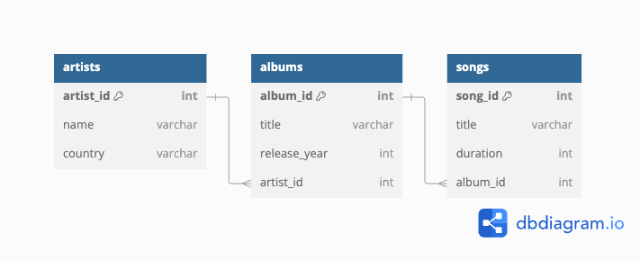
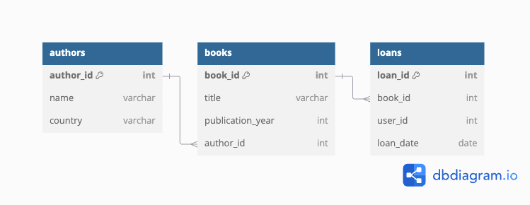

# Modelo relacional

# Modelo de Datos

- Un modelo de datos define la estructura lógica, incluidas las relaciones y limitaciones que determinan cómo se almacenan los datos y cómo se accede a ellos.
- Es una colección de **conceptos** que describen los datos en una base de datos E.G. Canciones, Artistas y Álbumes.
- Un Esquema de datos: es la descripción específica (**Concreta**) de una colección de datos en un DBMS. Es la estructura de los conceptos en un DBMS

## Tipos de modelos de datos

Hay muchos tipos de modelos de bases de datos. Algunos de los más comunes incluyen:

- Modelo de base de datos jerárquico
- Modelo relacional
- Modelo de red
- Modelo de base de datos orientado a objetos
- Modelo entidad-relación
- Modelo de documentos
- Modelo entidad-atributo-valor
- Esquema de estrella
- Modelo relacional de objetos, que combina los dos que forman su nombre

Consulte este [link](https://www.lucidchart.com/pages/es/que-es-un-modelo-de-base-de-datos) para saber un poco más de los tipos de modelos de datos.

---

# Modelo Relacional

El modelo relacional es un paradigma utilizado en bases de datos que organiza la información en estructuras tabulares llamadas relaciones o tablas. Cada tabla está compuesta por columnas (atributos) y filas (tuplas). El modelo relacional se basa en la teoría matemática de relaciones y proporciona un marco lógico para almacenar, consultar y gestionar datos, garantizando consistencia e integridad a través de restricciones como claves primarias y foráneas.

# **Modelo Relacional: Explicación con Ejemplo**

## **Ejemplo: Sistema de Tienda Digital de Música**

El ejemplo modela un sistema para gestionar una tienda digital de música con las siguientes entidades:

1. **Artistas** (`artists`): Información sobre los artistas disponibles.
2. **Álbumes** (`albums`): Información sobre los álbumes publicados.
3. **Canciones** (`songs`): Información sobre las canciones disponibles.

---

## **Conceptos del Modelo Relacional**

### **1. Table (Tabla)**
**Definición**: Una tabla es una colección de datos organizados en filas (tuplas) y columnas (atributos) dentro de una base de datos relacional.

**Ejemplo**:
La tabla `artists` representa información de artistas:
| artist_id | name          | country      |
|-----------|---------------|--------------|
| 1         | Taylor Swift  | USA          |
| 2         | BTS           | South Korea  |
| 3         | Adele         | UK           |

---

### **2. Tuple (Tupla)**
**Definición**: Una fila en una tabla que representa un registro único.

**Ejemplo**:
La fila `1, Taylor Swift, USA` es una tupla en la tabla `artists`.

---

### **3. Attribute (Atributo)**
**Definición**: Una columna en una tabla que define una propiedad de las tuplas.

**Ejemplo**:
En `artists`, los atributos son `artist_id`, `name` y `country`.

---

### **4. Relation Instance (Instancia de Relación)**
**Definición**: El conjunto actual de tuplas en una tabla en un momento específico.

**Ejemplo**:
La tabla `artists` con las tuplas actuales es una instancia de relación.

---

### **5. Domain (Dominio)**
**Definición**: El conjunto de valores permitidos que un atributo puede tomar en una tabla. Define las restricciones sobre los datos que pueden almacenarse en un atributo y asegura la integridad de los datos al evitar valores no válidos.

Los dominios pueden ser de dos tipos:
1. Dominios predefinidos, que corresponde a los tipos de datos que normalmente proporcionan los lenguajes de bases de datos, como por ejemplo, los enteros, cadenas de caracteres, booleanos, etc.
2. Dominios definidos por el usuario, que pueden ser más específicos.

**Ejemplo**:
Para `country`, el dominio es un conjunto de cadenas que representan países válidos como `USA`, `South Korea`, `UK`, etc. Esto significa que:
- Un valor como `Mars` sería inválido, porque no pertenece al dominio definido.
- El dominio también puede incluir restricciones adicionales, como límites de longitud (por ejemplo, una cadena de hasta 50 caracteres).

Los dominios son útiles para asegurar que los datos en un atributo sean consistentes y válidos. Por ejemplo, si el dominio de la columna release_year en albums permite solo años entre 1900 y el año actual, cualquier valor fuera de este rango sería rechazado.

---

### **6. Atomic (Atómico)**
**Definición**: Un valor atómico es aquel que no puede dividirse en partes más pequeñas o que no tiene subestructuras significativas desde el punto de vista del modelo. Esto significa que cada celda en una tabla debe contener un único valor indivisible

**Ejemplo**:
El valor `330` en la columna `duration` de la tabla `songs` es atómico. Caso contrario, si hubiese una celda que contuviera `3:30`, sería una violación del principio de atomicidad, ya que contiene dos valores en una sola celda como son minutos y segundos.

> Requerimos que, para todas las relaciones `r`, los dominios de todos los atributos de `r` sean atómicos.

---


### **7. Null Value (Valor nulo)**
**Definición**: Representa un valor desconocido o ausente.

**Ejemplo**:
Si un artista no tiene país asignado, su valor en `country` sería `NULL`.

---

### **8. Database Schema (Esquema de Base de Datos)**
**Definición**: La estructura general de una base de datos que define tablas, atributos y relaciones entre ellas.

**Ejemplo**:
El esquema incluye las tablas `artists`, `albums` y `songs`, con sus atributos y relaciones, representado en el siguiente diagrama:


---

### **9. Database Instance (Instancia de Base de Datos)**
**Definición**: Los datos actuales almacenados en una base de datos en un momento dado.

**Ejemplo**:
El contenido actual de todas las tablas del sistema.

---

### **10. Relation Schema (Esquema de Relación)**
**Definición**: Describe la estructura de una tabla, incluyendo su nombre y atributos.

**Ejemplo**:
El esquema de `artists` es:
- Nombre: `artists`
- Atributos: `artist_id`, `name`, `country`

---

### **11. Keys (Llaves)**
**Definición**: Un subconjunto de atributos que identifican de manera única una tupla.

---

### **12. Superkey (Superclave)**
**Definición**: Una superkey es cualquier conjunto de uno o más atributos que puede identificar de manera única una tupla en una tabla.

**Ejemplo**:
En la tabla `artists`, los atributos son:
- `artist_id`
- `name`
- `country`

Sabemos que `artist_id` es único, lo que nos permite identificar otras **superkeys**:

1. **{artist_id}**  
   - Es única porque `artist_id` identifica de manera exclusiva cada tupla.

2. **{artist_id, name}**  
   - Explicación: Incluye `artist_id`, que ya es único. Por lo tanto, cualquier conjunto que contenga `artist_id` es una superkey.

3. **{artist_id, country}**  
   - Explicación: Aunque `artist_id` ya es único, agregar `country` también resulta en una superkey.

4. **{artist_id, name, country}**  
   - Explicación: Incluye todos los atributos, lo que garantiza unicidad.

5. **{name, country}** (si asumimos que la combinación es única)  
   - Explicación: Si asumimos que no existen dos artistas con el mismo nombre y país, esta combinación también podría ser una superkey.

---

### **13. Candidate Keys (Llaves candidatas)**
**Definición**: Un conjunto **mínimo** de atributos que identifican de manera única una tupla.

**Ejemplo**:
En este caso, `{artist_id}` sería la única candidate key (si asumimos que `artist_id` es único y obligatorio).


>**Nota**: Todas las candidate keys son superkeys, pero no todas las superkeys son candidate keys, ya que estas últimas son el subconjunto mínimo de atributos que garantizan unicidad.

---

### **14. Primary Key (Llave primaria)**
**Definición**: Una candidate key seleccionada para identificar de manera única las tuplas de una tabla.

**Ejemplo**:
En `artists`, la clave primaria es `artist_id`.

---

### **15. Primary Key Constraints**
**Definición**: Garantiza que los valores de la clave primaria sean únicos y no nulos.

**Ejemplo**:
`artist_id` debe ser único y no nulo en la tabla `artists`.

---

### **16. Foreign Key (Llave foránea)**
**Definición**: Un atributo en una tabla que se refiere a la clave primaria de otra tabla.

**Ejemplo**:
En la tabla `albums`, el atributo `artist_id` es una foreign key que refiere a `artist_id` en `artists`.

---

### **17. Foreign Key Constraints (Restricciones de clave foránea)**
**Definición**: Garantizan que los valores de la foreign key correspondan a valores existentes en la tabla referenciada.

**Ejemplo**:
Cada `artist_id` en `albums` debe existir en `artists`.

---

### **18. Referencing Relation (Relacion de referencia)**
**Definición**: La tabla que contiene la foreign key.

**Ejemplo**:
`albums` es la tabla que referencia a `artists`.

---

### **19. Referenced Relation (Relación referenciada)**
**Definición**: La tabla que contiene la clave primaria referenciada.

**Ejemplo**:
`artists` es la tabla referenciada por `albums`.

---

### **20. Referential Integrity Constraint (Restricción de integridad referencial)**
**Definición**: Asegura la consistencia entre una foreign key y la clave primaria que referencia.

**Ejemplo**:
No puedes tener un `artist_id` en `albums` que no exista en `artists`.

### **21. Cardinalidad**
**Definición**: La cardinalidad de una relación describe el número de filas (tuplas) presentes en una tabla en un momento específico.

**Ejemplo**:  
Si la tabla `artists` tiene las siguientes tres tuplas:
| **artist_id** | **name**        | **country**   |
|---------------|-----------------|---------------|
| 1             | Taylor Swift    | USA           |
| 2             | BTS             | South Korea   |
| 3             | Adele           | UK            |

La cardinalidad de la relación `artists` es **3**, porque hay tres filas en la tabla.

---

### **22. Grado**
**Definición**: El grado de una relación se refiere al número de atributos (columnas) en una tabla.

**Ejemplo**:  
Para la tabla `albums`:
| **album_id** | **title**                  | **release_year** | **artist_id** |
|--------------|----------------------------|------------------|---------------|
| 1            | Red                        | 2012             | 1             |
| 2            | Map of the Soul: 7         | 2020             | 2             |
| 3            | 25                         | 2015             | 3             |

El grado de la relación `albums` es **4**, porque hay cuatro atributos en la tabla: `album_id`, `title`, `release_year`, y `artist_id`.

---

**Nota Importante**:
- **Cardinalidad** se enfoca en la cantidad de datos en la tabla (número de filas).
- **Grado** describe la estructura de la tabla (número de columnas).

---
## Características
- Los datos son atómicos.
- Los datos de cualquier columna son de un solo tipo.
- Cada columna posee un nombre único.
- El orden de las columnas no es de importancia para la tabla.
- Las columnas de una relación se conocen como atributos.
- Cada atributo tiene un dominio.
- No existen 2 filas en la tabla que sean idénticas.
- Cada relación tiene un nombre específico y diferente al resto de las relaciones.
- Los valores de los atributos son atómicos: en cada tupla, cada atributo (columna) toma un solo valor. Se dice que las relaciones están normalizadas.
- El orden de los atributos no importa: los atributos no están ordenados.
- Cada tupla es distinta de las demás: no hay tuplas duplicadas
- El orden de las tuplas no importa: las tuplas no están ordenadas.

---

## Ejercicio en clase

Dado el siguiente esquema y tablas, complete la tabla:

### Esquema




### Tablas de Ejemplo: Sistema de Biblioteca Digital

#### **Tabla: authors**

| **author_id** | **name**                | **country**   |
|---------------|-------------------------|---------------|
| 1             | Gabriel García Márquez | Colombia      |
| 2             | J.K. Rowling           | UK            |
| 3             | Haruki Murakami        | *(NULL)*      |

---

#### **Tabla: books**

| **book_id** | **title**                                | **publication_year** | **author_id** |
|-------------|------------------------------------------|-----------------------|---------------|
| 1           | Cien Años de Soledad                    | 1967                  | 1             |
| 2           | Harry Potter and the Philosopher's Stone| 1997                  | 2             |
| 3           | Kafka on the Shore                      | 2002                  | 3             |

---

#### **Tabla: loans**

| **loan_id** | **book_id** | **user_id** | **loan_date** |
|-------------|-------------|-------------|---------------|
| 1           | 1           | 101         | 2024-11-01    |
| 2           | 3           | 102         | 2024-11-05    |
| 3           | 2           | 103         | 2024-11-10    |


### Complete

| **Concepto**                 | **Ejemplo en el Sistema**                                                                       |
|------------------------------|--------------------------------------------------------------------------------------------------------------|
| **Entidades (Tablas)**       |                                                                                                              |
| **Atributos**                |                                                                                                              |
| **Tuplas**                   |                                                                                                              |
| **Claves Primarias (PK)**    |                                                                                                              |
| **Claves Foráneas (FK)**     |                                                                                                              |
| **Superclaves (Superkeys)**  |                                                                                                              |
| **Llaves Candidatas**        |                                                                                                              |
| **Dominios**                 |                                                                                                              |
| **Valores Nulos**            |                                                                                                              |
| **Valores Atómicos**         |                                                                                                              |
| **Relación Referenciada**    |                                                                                                              |
| **Relación De Referencia**   |                                                                                                              |
| **Cardinalidad**             |                                                                                                              |
| **Grado**                    |                                                                                                              |


---

# Modelos Relacionales vs Grafos (Ejemplo real)

## **Caso de Uso: Gestión de Recursos en la Nube**

> VER CARPETA [ejemplos/JupiterOne](ejemplos/JupiterOne) PARA VER LOS SCRIPTS UTILIZADOS EN CLASE.

En este ejemplo, modelamos la relación entre activos de infraestructura en la nube. Un `aws_account` gestiona recursos como `aws_ec2_instance` y `aws_s3_bucket`, mientras que los recursos están interconectados, por ejemplo, una instancia EC2 puede conectarse a un bucket S3. Este caso refleja un entorno dinámico y densamente conectado, donde la exploración de relaciones y dependencias es crucial para la administración y seguridad.

---

## **Modelo Relacional (Tabular)**

El modelo relacional utiliza dos tablas principales:

1. **`entities`**: Representa los recursos con columnas para ID, tipo y nombre.
2. **`relationships`**: Define las relaciones entre entidades, con columnas para la entidad origen, la entidad destino y el tipo de relación.

### **Ventajas del modelo relacional**
- Es ampliamente conocido y utilizado.
- Eficiente para datos tabulares y relaciones simples.

### **Limitaciones**
- Las consultas complejas requieren múltiples `JOIN`, lo que degrada el rendimiento.
- Difícil de escalar en grafos densos o profundamente conectados.

---

## **Modelo de Datos Orientado a Grafos**

El modelo de grafos representa los recursos como nodos (`aws_account`, `aws_ec2_instance`, `aws_s3_bucket`) y las relaciones como aristas etiquetadas con propiedades (`HAS`, `OWNS`, `CONNECTS_TO`).

### **Ventajas del modelo de grafos**
1. **Consultas Naturales y Eficientes**:
   - Consultas como "¿Qué recursos posee esta cuenta y cómo están conectados?" son directas y rápidas.
   - Ejemplo Cypher:
     ```cypher
     MATCH (account:aws_account)-[:HAS]->(resource)
     RETURN account, resource;
     ```
2. **Escalabilidad para Grafos Densos**:
   - Ideal para sistemas con relaciones altamente conectadas, como dependencias entre recursos de la nube.
3. **Visualización Intuitiva**:
   - Representa las conexiones en un formato gráfico natural, facilitando el análisis.

### **Limitaciones**
- Requiere herramientas específicas (como Neo4j) y conocimiento adicional.

---

## **Por qué el modelo de grafos es más adecuado**

En este caso, la estructura de las relaciones (interconexión entre cuentas, instancias y buckets) es tan importante como las entidades mismas. El modelo de grafos optimiza la exploración y análisis de estas conexiones, permitiendo:
- Consultas rápidas sobre relaciones complejas.
- Escalabilidad para grandes volúmenes de datos conectados.
- Representaciones visuales intuitivas para la toma de decisiones.

En resumen, para casos donde las relaciones son el foco, como la gestión de recursos en la nube, el modelo orientado a grafos supera al modelo relacional en flexibilidad y eficiencia.

---

# Bibliografía
- [https://www.lucidchart.com/pages/es/que-es-un-modelo-de-base-de-datos]

- Integridad: [https://online.hbs.edu/blog/post/what-is-data-integrity](https://online.hbs.edu/blog/post/what-is-data-integrity)

- [https://openaccess.uoc.edu/bitstream/10609/200/8/Bases de datos_Módulo2_El modelo relacional y el álgebra relacional.pdf](https://openaccess.uoc.edu/bitstream/10609/200/8/Bases%20de%20datos_M%C3%B3dulo2_El%20modelo%20relacional%20y%20el%20%C3%A1lgebra%20relacional.pdf)
