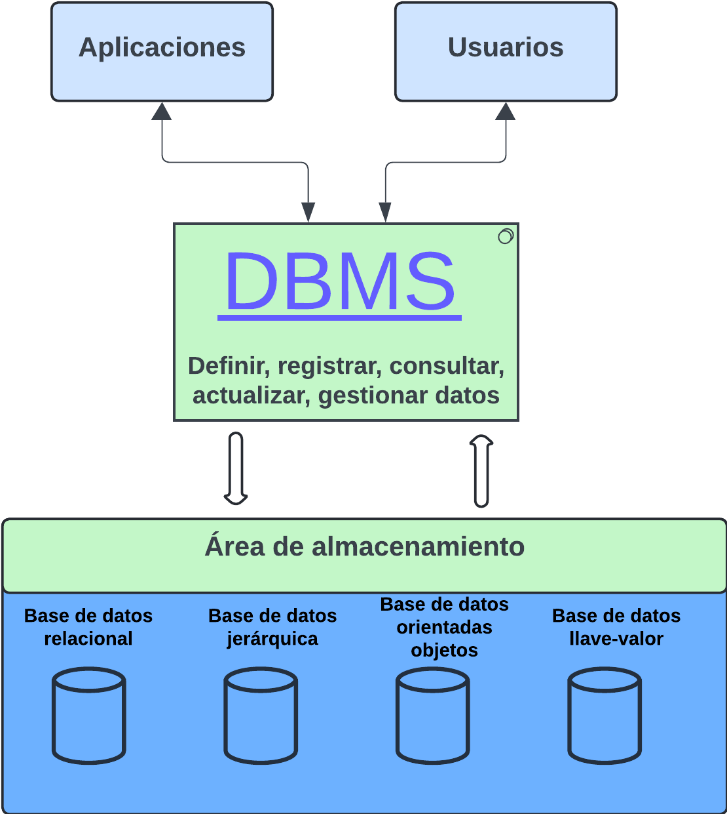
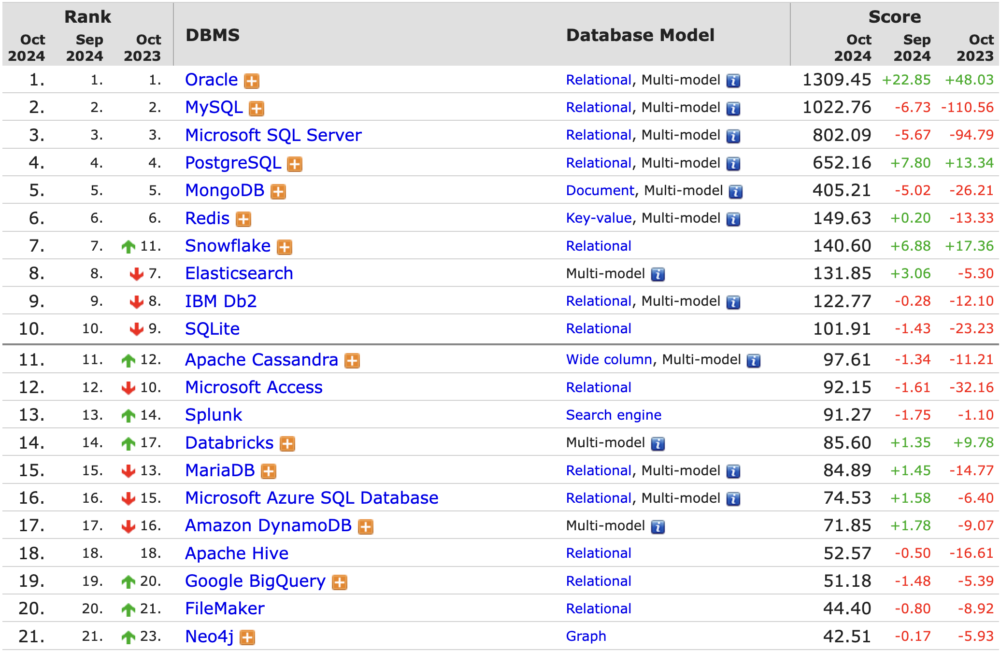
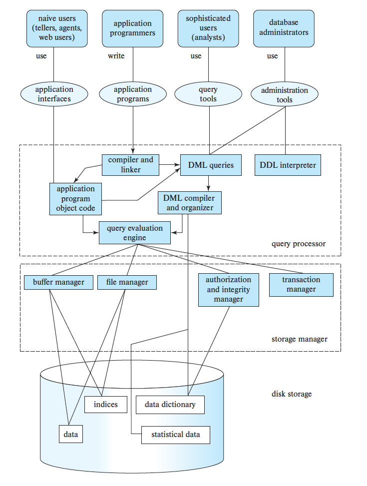
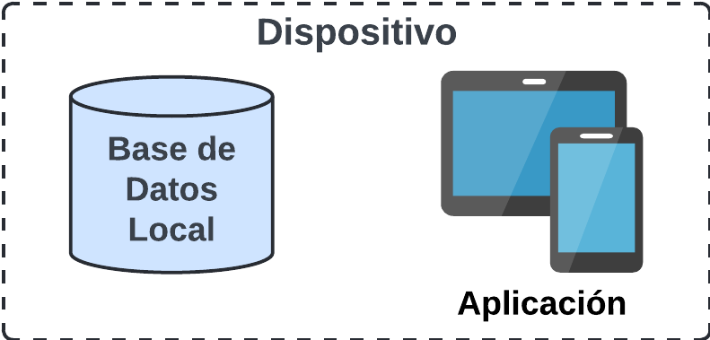
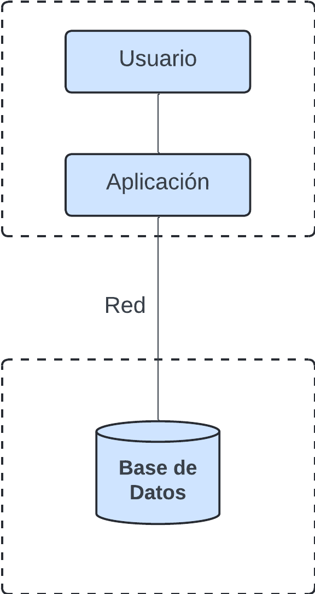
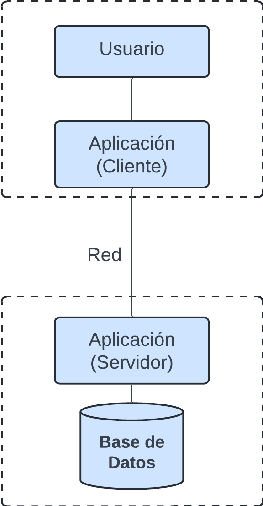

# Introducción a las bases de datos

## Bases de Datos

Es importante no confundir las bases de datos con los sistemas de gestión de bases de datos (DBMS, por sus siglas en inglés).

Una base de datos es una **colección organizada de datos interrelacionados** que representa y modela aspectos del mundo real. Este concepto se refiere a un "metamodelo", es decir, una representación abstracta de un escenario de la vida real.

Por ejemplo, una base de datos que almacene los registros de estudiantes inscritos en una clase estaría modelando un escenario del mundo real, como la gestión académica de una universidad.

Las bases de datos son un **componente fundamental** en la mayoría de los sistemas de software, como el sistema administrativo de una universidad.

A nivel profesional, ya sea como desarrollador de software, científico de datos, experto en inteligencia artificial o en biología computacional, siempre estarás interactuando con datos. Por ello, el manejo adecuado de bases de datos es crucial para cualquier disciplina que involucre datos.

Este curso te proporcionará las herramientas y conocimientos para comprender cómo funcionan las bases de datos y cómo interactuar con ellas de manera eficiente.

<aside>
💡 La base de datos más utilizada y desplegada en el mundo es SQLite, que se encuentra instalada en la mayoría de los teléfonos móviles

</aside>

## Historia

- **Principios del siglo XX**: Se usan tarjetas perforadas para el procesamiento de datos del censo en EE. UU., con sistemas mecánicos para tabular los resultados.
- **Años 50 y 60**: Se desarrollan las cintas magnéticas para almacenamiento de datos. Las tareas de procesamiento de datos, como la nómina, son automatizadas con cintas y tarjetas perforadas, donde el procesamiento de datos es secuencial.
- **Finales de los 60 y principios de los 70**: La aparición de los discos duros permite el acceso directo a los datos, liberando las restricciones de secuencialidad. Se desarrollan los modelos de datos en red y jerárquicos. Edgar Codd define el modelo relacional en 1970, lo que marca el nacimiento de las bases de datos relacionales. La propuesta del modelo relacional de Edgar Codd se puede encontrar en [https://www.seas.upenn.edu/~zives/03f/cis550/codd.pdf](https://www.seas.upenn.edu/~zives/03f/cis550/codd.pdf)
- **Finales de los 70 y 80**: Surgen los primeros sistemas comerciales de bases de datos relacionales como IBM DB2, Oracle e Ingres, que mejoran el procesamiento de consultas declarativas. Las bases de datos relacionales superan a los modelos en red y jerárquicos en rendimiento y facilidad de uso. La primera base de datos relacional se llamó System R. [https://en.wikipedia.org/wiki/IBM_System_R](https://en.wikipedia.org/wiki/IBM_System_R)
- **Años 90**: El lenguaje SQL se utiliza principalmente para aplicaciones de soporte de decisiones. Con el crecimiento explosivo de la web, las bases de datos relacionales se despliegan extensamente para manejar grandes volúmenes de transacciones y ofrecer interfaces web.
- **Años 2000**: Surge el uso de datos semi-estructurados como XML y JSON. Se popularizan las bases de datos de código abierto (PostgreSQL y MySQL), y se desarrollan bases de datos especializadas para análisis de datos y grandes volúmenes de información. Surgen las bases de datos de grafos gracias al auge de las aplicaciones de redes sociales.
- **Años 2010**: Las bases de datos NoSQL ganan popularidad debido a su escalabilidad y flexibilidad, pero sus limitaciones llevan a que evolucionen para soportar mayor consistencia. Aumenta el uso de bases de datos en la nube y la provisión de software como servicio (SaaS).

## **Ejemplo: Sistema de una Tienda Digital de Música**

Vamos a diseñar una base de datos que modele un sistema para gestionar música digital, con el fin de registrar información sobre artistas, canciones y álbumes.

### **Requerimientos:**

- **Artistas**: Debemos almacenar información relevante de los artistas.
- **Canciones y Álbumes**: Necesitamos registrar las canciones y los álbumes lanzados por cada artista.

### **Enfoque Inicial: Archivos en Disco**

La forma más simple de implementar una base de datos sería utilizando archivos en disco, como archivos CSV (Comma Separated Values):

- Gestionar estos archivos directamente desde nuestras aplicaciones.
- Usar un archivo separado para cada entidad, como artistas y canciones.
- La aplicación tendría que cargar y reescribir el archivo cada vez que se lee o modifica un registro.

Por ejemplo, el archivo `artistas.csv` podría tener la siguiente estructura:

**`artistas.csv`**

**ARTISTA** (nombre, año de fundación, país de origen)

```csv
Korn; 1993; USA
System of a Down; 1994; USA
Linkin Park; 1996; USA
```

De manera similar, un archivo `canciones.csv` podría almacenar información de las canciones:

**`canciones.csv`**

**CANCION** (nombre, álbum, año)

```csv
Freak On a Leash; Follow the Leader; 1998
Chop Suey!; Toxicity; 2001
Points of Authority; Hybrid Theory; 2000
```

### **Ejemplo de Funcionalidad: Obtener Canciones por Álbum**

A continuación, un ejemplo de código para obtener las canciones del álbum “Hybrid Theory”:

```javascript
function cancionesPorAlbum(nombreArchivo, album) {
    let archivoCanciones = open(nombreArchivo);
    let listadoCanciones = [];
    for (let linea of archivoCanciones.readlines()) {
        let cancion = CSV.parse(linea);
        if (cancion[1] === album) {
            listadoCanciones.push(cancion[0]);
        }
    }
    return listadoCanciones;
}
```

Aunque esta implementación funciona, no es la ideal. ¿Por qué? Veamos algunos problemas.

### **Problemas con Archivos de Texto Planos: Integridad**

- ¿Cómo garantizamos que todas las canciones de un álbum pertenezcan al artista correcto?
- ¿Qué ocurre si accidentalmente sobrescribimos un valor, como el año de lanzamiento, con un dato incorrecto? Por ejemplo, cambiar "1989" por "enero".
- ¿Cómo asociamos a todos los artistas que colaboraron en un álbum? (En caso de múltiples artistas).
- ¿Qué pasa si eliminamos un artista que tiene álbumes registrados?

### **Problemas con Archivos de Texto Planos: Durabilidad**

- ¿Qué pasa si la máquina falla justo cuando el programa está actualizando un archivo?
- ¿Cómo podemos replicar una base de datos basada en archivos planos en varias máquinas para garantizar alta disponibilidad?

### **Problemas con Archivos de Texto Planos: Otros problemas**

- ¿Qué sucede si queremos ejecutar la misma aplicación en otra máquina o en otro lenguaje de programación?
- ¿Cómo manejamos conflictos si dos procesos intentan modificar el mismo archivo al mismo tiempo?
- ¿Cómo garantizamos la seguridad de los datos? (Por ejemplo, en un escenario con información sensible como datos médicos).

## **Sistemas Gestión de Bases de datos (DBMS)**

Un **DBMS** es un software especializado en definir, almacenar, manipular y consultar datos en un computador. 

El siguiente diagrama ilustra el esquema base de como funciona un DBMS: 



Imagen de autoria propia.

Un DBMS:

- Resuelve muchos de los problemas y preguntas que surgen al trabajar con archivos planos.
- Proporciona un mecanismo abstracto para gestionar los datos, permitiéndonos enfocarnos en su uso sin preocuparnos por cómo están implementados internamente.
- Es un estándar: una vez que alguien aprende a usar un DBMS, no necesita explicar a otros usuarios cómo gestionar los datos, ya que estos pueden consultar la documentación oficial y utilizar el sistema de manera eficiente.

# **DBMS más populares**



Imagen tomada de  https://db-engines.com/en/ranking

El puntaje es calculado con base en:

- Número de menciones del sistema en sitios web
- Interés general en el sistema
- Frecuencia de discusiones técnicas sobre el sistema
- Número de ofertas de trabajo donde el sistema es mencionado
- Número de perfiles en redes profesionales donde el sistema es mencionado
- Relevancia en redes sociales

## **RDBMS (Relational Database Management System) - Sistema de Gestión de Bases de Datos Relacional**

- Es el tipo de sistema de gestión de bases de datos más común.
- Almacena la información en tablas, las cuales pueden estar conectadas entre sí a través de relaciones (modelo relacional - lo veremos en detalle en clases posteriores).

Ejemplo de almacenamiento en un RDBMS

Tabla: `artista`

| **id_artista** | **nombre** | **fundacion** | **origen** |
| --- | --- | --- | --- |
| 1 | Korn | 1993 | USA |
| 2 | System of a Down | 1994 | USA |
| 3 | Linkin Park | 1996 | USA |

Tabla: `album`

| **id_album** | **titulo** | **año** | **id_artista** |
| --- | --- | --- | --- |
| 1 | Follow the Leader | 1993 | 1 |
| 2 | Toxicity | 2001 | 2 |
| 3 | Hybrid Theory | 2000 | 3 |

Tabla: `cancion`

| **id_cancion** | **titulo** | **id_album** | **duracion** |
| --- | --- | --- | --- |
| 1 | Freak On a Leash | 1 | 4:15 |
| 2 | Chop Suey! | 2 | 3:30 |
| 3 | Points of Authority | 3 | 3:20 |

Este modelo permite representar el ejemplo del sistema de tienda digital de música usando un esquema de tablas donde a través de llaves se puede referenciar los artistas de los álbumes y los álbumes de las canciones.

## **Características de un DBMS**

- **Almacena datos físicamente** en el sistema.
- Proporciona una **interfaz gráfica** que permite a los usuarios visualizar y gestionar los datos.
- **Procesa instrucciones SQL** (Structured Query Language) para interactuar con la base de datos.
- **Permite agregar, modificar y eliminar datos** de manera controlada.
- **Facilita la modificación de la estructura de la base de datos**, como la creación de nuevas tablas o la alteración de columnas.
- **Habilita el acceso concurrente a los datos**, permitiendo que múltiples usuarios trabajen simultáneamente sin conflictos.
- **Gestiona restricciones** para garantizar la integridad de los datos, como claves primarias y foráneas.
- **Mantiene estructuras internas optimizadas** para el acceso rápido a los datos y un procesamiento eficiente.
- **Ofrece una gestión granular de usuarios**, permitiendo definir permisos y roles específicos.
- **Incluye capacidades de respaldo**, asegurando la recuperación de datos en caso de fallos.
- **Garantiza un acceso seguro a los datos**, protegiéndolos contra accesos no autorizados.

## Componentes de un DBMS



### Query Processor (Procesador de Consultas)

Este componente actúa como el cerebro que interpreta y ejecuta las consultas de los usuarios.

**Componentes internos:**

- **Parser (Analizador):** Verifica la sintaxis de la consulta (por ejemplo, SQL) para asegurarse de que sea válida.
- **DDL Interpreter**: Procesa comandos de definición de datos (`CREATE`, `ALTER`, `DROP`), definiendo estructuras como tablas o índices y comunicándolas al gestor de almacenamiento.
- **DML Compiler**: Traduce y optimiza consultas de manipulación de datos (`SELECT`, `INSERT`, `UPDATE`, `DELETE`), generando un plan eficiente para ejecutarlas.
- **Query Evaluation Engine**: Ejecuta el plan optimizado, accede a los datos en el almacenamiento y devuelve los resultados al usuario.

### Storage Manager (Administrador de almacenamiento):

Este componente gestiona la interacción entre el DBMS y los datos almacenados físicamente en el disco.

**Componentes internos:**

- **Authorization and Integrity Manager (Gestor de Autorización e Integridad):** Controla el acceso a los datos según los permisos definidos y asegura que los datos cumplan con las reglas de integridad.
- **Transaction Manager (Gestor de Transacciones):** Garantiza que las operaciones sobre la base de datos se realicen de manera atómica y consistente, incluso en caso de fallos.
- **File Manager (Gestor de Archivos):** Se encarga de organizar los datos en estructuras lógicas (tablas, índices, etc.) y físicas (archivos en disco).
- **Buffer Manager (Gestor de Buffers):** Administra el intercambio de datos entre la memoria principal y el almacenamiento en disco para maximizar el rendimiento.

### Disk Storage (Almacenamiento en Disco)

Es el lugar físico donde se almacenan los datos de la base de datos.

**Características:**

- **Estructuras de almacenamiento:** Los datos se organizan en bloques, páginas y archivos en el disco.
- **Eficiencia de acceso:** Para optimizar el rendimiento, el DBMS usa índices y métodos de almacenamiento como registros ordenados.
- **Respaldo y recuperación:** Proporciona mecanismos para respaldar datos y restaurarlos en caso de fallos.

## Arquitecturas de Bases de Datos

Uno de los aspectos fundamentales de la arquitectura de bases de datos es su arquitectura por niveles. Este concepto se refiere a la separación física y lógica de las funcionalidades en diferentes capas o niveles, como el almacenamiento y el procesamiento de datos.

## Arquitectura de un nivel (One Tier)



- La aplicación y la base de datos se ejecutan en el mismo entorno, como una computadora personal o un dispositivo móvil. Es la arquitectura más simple, adecuada para aplicaciones locales.
- **Ventajas:** Fácil de implementar y mantener, sin comunicación en red.
- **Desventajas:** No es escalable ni adecuada para múltiples usuarios.

### Arquitectura de dos niveles (Two Tier)



- Divide la aplicación en dos partes:
    - **Aplicación (Cliente):** Interfaz gráfica donde los usuarios interactúan.
    - **Servidor de base de datos:** Donde se almacenan y gestionan los datos.
- **Ventajas:** Separación básica de lógica y datos, mayor escalabilidad que la de un nivel. No hay latencia de red.
- **Desventajas:** Limitada para aplicaciones más complejas y redes grandes.

### Arquitectura de tres niveles (Three Tier)

.

- Introduce un nivel intermedio para manejar la lógica de la aplicación:
    - **Capa de presentación (cliente):** Interfaz gráfica.
    - **Capa lógica (servidor de aplicaciones):** Procesa las reglas del negocio y la lógica de la aplicación.
    - **Capa de datos (servidor de base de datos):** Almacena y gestiona los datos.
- **Ventajas:** Alta escalabilidad, flexibilidad y separación de responsabilidades. Ideal para aplicaciones distribuidas.
- **Desventajas:** Mayor complejidad y costos de implementación.

## Bibliografía

- Silberschatz, A., Korth, H. F., & Sudarshan, S. (2019). Database System Concepts (7th ed.). McGraw Hill Education.
- colaboradores de Wikipedia. (2024, 23 junio). Sistema de gestión de bases de datos. Wikipedia, la Enciclopedia Libre. [https://es.wikipedia.org/wiki/Sistema_de_gesti%C3%B3n_de_bases_de_datos](https://es.wikipedia.org/wiki/Sistema_de_gesti%C3%B3n_de_bases_de_datos)
- Marcos, M. F. (2022, December 9). *Las profesiones más buscadas en ciencia de datos*. Tecnología++. [https://blogs.uoc.edu/informatica/es/profesiones-data-science-mas-buscadas/](https://blogs.uoc.edu/informatica/es/profesiones-data-science-mas-buscadas/)
- Bruffa, A. (2023, 26 febrero). *Empleos en bases de datos para elegir en 2023*. LearnSQL.es. [https://learnsql.es/blog/empleos-en-bases-de-datos-para-elegir-en-2023](https://learnsql.es/blog/empleos-en-bases-de-datos-para-elegir-en-2023)
- [https://db-engines.com/en/ranking](https://db-engines.com/en/ranking) (Ranking de los DBMS más usados)