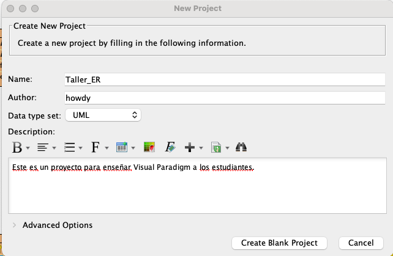
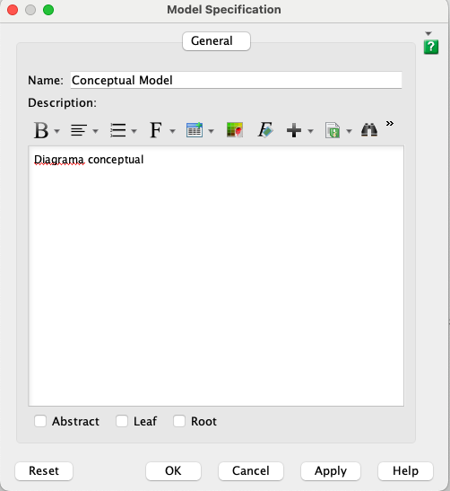
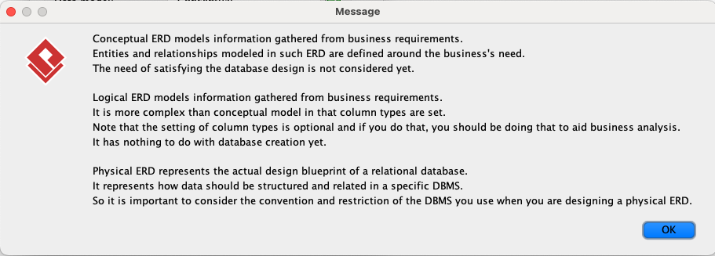
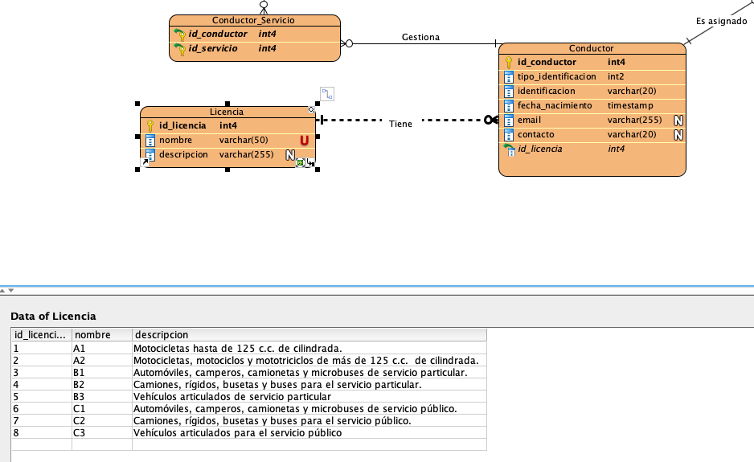

# **Modelo Físico con Visual Paradigm**

Es importante recordar los distintos modelos estudiados en la [Clase 5 - Diseño de BD usando modelo E-R](Clase%205%20-%20Dise%C3%B1o%20de%20BD%20usando%20modelo%20E-R.md). A continuación, se resumen los conceptos clave:

---

### **Modelo Conceptual**
- **Objetivo:** Traducir los requerimientos en un esquema conceptual utilizando un modelo de datos abstracto como el Modelo Entidad-Relación (E-R).
- **Resultado:** Un diagrama Entidad-Relación que representa gráficamente:
  - **Entidades:** Objetos principales del sistema.
  - **Relaciones:** Cómo interactúan las entidades.
  - **Restricciones:** Cardinalidades, atributos clave, entre otros.
- **Revisión:** Verificar que el esquema cumpla con los requisitos funcionales.

---

### **Modelo Lógico**
- **Objetivo:** Mapear el esquema conceptual a un modelo de datos que pueda implementarse en un sistema de gestión de bases de datos (DBMS).
- **Resultado:** Un esquema lógico que traduce las entidades y relaciones en tablas relacionales, incluyendo claves primarias y foráneas.
- **Ejemplo:** Convertir la entidad "Libro" en una tabla con columnas como `isbn`, `titulo` y `autor`.

---

### **Modelo Físico**
- **Objetivo:** Implementar el diseño en un DBMS seleccionado. Esto incluye especificar detalles técnicos como tipos de datos, índices y configuraciones de rendimiento.
- **Resultado:** Un esquema físico optimizado para el DBMS seleccionado.
- **Ejemplo:** Crear las tablas en PostgreSQL y agregar índices para optimizar consultas.

---

## **Uso de Visual Paradigm**

Con Visual Paradigm es posible modelar los tres tipos de diagramas: conceptual, lógico y físico. 

> **Nota:** En las versiones superiores a Community Edition, existe el [Model Transitor](https://www.visual-paradigm.com/support/documents/vpuserguide/26/533/29061_modeltransit.html) que permite generar diagramas lógicos o físicos a partir de un diagrama conceptual. Sin embargo, en la versión Community esta funcionalidad no está disponible.

### **Recomendación:**
1. Crear el modelo conceptual con herramientas sencillas como *draw.io*.
2. Generar manualmente las reglas de transformación al modelo relacional y crear el modelo lógico con Visual Paradigm.
3. Normalizar el modelo lógico.
4. Crear el modelo físico en Visual Paradigm.

---

## **Creación de Diagramas usando Visual Paradigm**

### **Requisitos Previos**
- Tener Visual Paradigm instalado.
- Contar con una instancia de base de datos activa en Neon.tech.

---

### **Parte 1: Creación de un Nuevo Proyecto**
1. Abrir Visual Paradigm.
2. Seleccionar la opción `Project > New` desde la pantalla inicial.
3. Asignar un nombre al proyecto, por ejemplo: `Taller_ER`.

   

---

### **Parte 2: Crear Modelos**

#### **Crear el Modelo Conceptual**
1. Ir a `View > Project Browser`.
2. Hacer clic derecho en el proyecto y seleccionar: `Model > New Model Element`.
3. Nombrar el modelo como `Conceptual Model`. 

4. Crear un nuevo diagrama:
   - Seleccionar **Entity Relationship Diagram**.
   - Elegir una plantilla en blanco (`Blank`).
   - Asignar un nombre por defecto (`Conceptual Model Entity Relationship Diagram`).

5. Verifica que el modelo conceptual esté configurado:
   - Ir a `Diagram Navigator > Entity Relationship Diagram`.
   - Hacer clic derecho en el diagrama y seleccionar `Open Diagram Specification`.

Repetir este proceso para los modelos **Lógico** y **Físico**.

> Las diferencias entre los 3 tipos de diagramas según Visual Paradigm son las siguientes:

---

### **Parte 3: Creación del Modelo Físico**

#### **Elementos del Diagrama**

Una vez creado el modelo físico, en el panel izquierdo se pueden apreciar los elementos que se pueden crear dentro del diagrama dentro de los cuales destacan los siguientes:
- Entity
- View
- One-to-One Relationship
- One-to-Many Relationship
- Many-to-One Relationship
- Many-to-Many Relationship

Notese que Visual Paradigm usa por defecto la [notación de Martin y notación patas de gallo](https://www.lucidchart.com/pages/es/que-es-un-diagrama-entidad-relacion)

#### **Configurar PostgreSQL**
1. Ve a `Tools > DB > Database Configuration`.
2. Selecciona **PostgreSQL** como el sistema de gestión de bases de datos.
3. Configura la conexión con Neon.tech:
   - Copia la cadena de conexión desde Neon y pégala en la casilla `Connection URL`.
   - Crea una base de datos nueva si es necesario.
   - Descarga el driver de PostgreSQL desde la misma interfaz.

   

---

#### **Dibujar el Diagrama ER**
1. Usa las herramientas disponibles para crear entidades, columnas, y definir relaciones.
2. Configura las claves primarias, foráneas, y los tipos de datos para cada atributo.

Consulta esta guía para más detalles: [Drawing an ER Diagram in Visual Paradigm](https://www.visual-paradigm.com/support/documents/vpuserguide/3563/3564/85375_drawingentit.html).

---

### **Parte 4: Generar Diccionario de Datos**

Un **diccionario de datos** documenta los metadatos técnicos de la base de datos, como:
- Tipo de dato.
- Formato.
- Longitud.
- Posibles valores y restricciones.

#### **Pasos para Generar el Diccionario de Datos en Visual Paradigm**
1. Ve a `Tools > Doc. Composer > Build Doc From Scratch`.
2. Navega hasta el diagrama físico.
3. Arrastra al espacio de trabajo el modelo completo.
4. Selecciona cada entidad y usa el `Data Specification Template` para agregar columnas, tipos de datos y restricciones al documento.

---

### **Parte 5: Crear Base de Datos en Neon.tech desde Visual Paradigm**

Es posible crear la base de datos directamente en **Neon.tech** desde Visual Paradigm, siempre que la conexión a PostgreSQL esté configurada correctamente (como se explicó en la sección `Configurar PostgreSQL`). 

Una vez configurada, sigue [estos pasos](https://www.visual-paradigm.com/support/documents/vpuserguide/3563/3587/85407_generatingda.html) para generar la estructura de la base de datos directamente desde tu modelo físico.

---

### **Parte 6 (Opcional): Generar Datos para Probar el Modelo**

Visual Paradigm permite generar datos de prueba y guardarlos directamente en la base de datos. Sigue estos pasos:

1. Haz clic derecho en cualquier parte del fondo blanco del diagrama y selecciona la opción:  
   `Show Table Record Editor or View Editor`.

2. Selecciona una entidad en el diagrama para visualizar sus columnas.

3. En el panel inferior, ingresa manualmente los datos de prueba para las columnas de la entidad seleccionada.

Ejemplo:

4. Una vez completada la inserción de datos, repite los pasos de la **Parte 5** para actualizar la base de datos y reflejar los cambios.

---

Esto permitirá a los estudiantes probar sus modelos con datos reales y verificar la consistencia de su diseño.

---

### **Notas Finales**
1. Asegúrate de revisar el modelo antes de generar el diccionario de datos.
2. Documenta cada atributo y relación.

## **Bibliografía**

- https://www.lucidchart.com/pages/es/que-es-un-diagrama-entidad-relacion
- https://www.visual-paradigm.com/support/documents