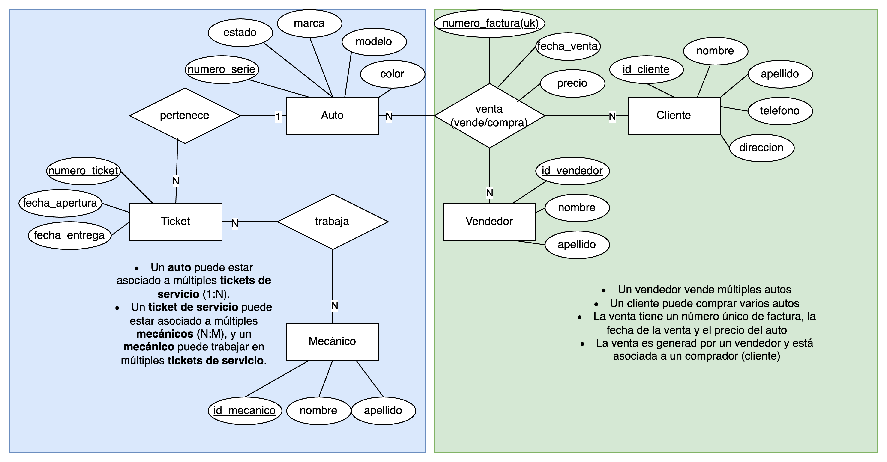

# Respuestas del parcial #1

1. ¿Cuáles son características de una arquitectura de dos niveles?</br>
a. La lógica del negocio se encuentra en el cliente.</br>
c.	La base de datos se encuentra en un servidor independiente.</br>

2. ¿Qué componente del procesador de consultas verifica la sintaxis de una instrucción SQL?</br>
c.	Parser

3. ¿Cuáles de los siguientes son lenguajes relacionales?</br>
a.	Cálculo relacional</br>
b.	Álgebra relacional</br>
d.	SQL – Structured Query Language</br>

4. ¿Cuáles de las siguientes son características clave de un Sistema de Gestión de Bases de Datos (DBMS)? </br>
a.	Permite agregar, modificar y eliminar datos de manera controlada.</br>
b.	Habilita el acceso concurrente a los datos.</br>
d.	Gestiona restricciones como claves primarias y foráneas para garantizar la integridad de los datos.</br>
f.	Incluye capacidades de respaldo para asegurar la recuperación de datos en caso de fallos.</br>
g.	Proporciona una interfaz gráfica para gestionar los datos.</br>

5.	Explique con sus palabras cual es la diferencia entre un DBMS y una base de datos.</br>
El DBMS es el software que gestiona y manipula los datos, mientras que la base de datos es el almacenamiento donde se encuentran los datos organizados.

6.	Defina brevemente con sus propias las diferencias entre el modelo datos conceptual, el modelo lógico y el modelo físico.</br>
El modelo conceptual es abstracto, el modelo lógico estructura las tablas y relaciones, y el modelo físico implementa los detalles técnicos específicos del DBMS.</br>
Modelo conceptual se enfoca en identificar entidades, relaciones y restricciones usando el modelo Entidad-Relación (E-R).</br>
Modelo lógico define las tablas, columnas, claves primarias y foráneas, sin incluir detalles técnicos del almacenamiento.</br>
Modelo físico implementa el modelo lógico en un DBMS específico. Incluye detalles técnicos como tipos de datos, índices, particionamiento y optimización de almacenamiento.

7. ¿Cuál es el esquema de relación de la tabla miembros?</br>
El esquema de relación es:</br>
```
miembros(id_miembro, nombre, fecha_registro, membresia_activa, id_gimnasio)
```

8. En la fila con `id_miembro = 3`, ¿qué elemento representa una tupla?</br>
R: La tupla es:</br>
```
(3, Pedro Ramírez, 2024-01-20, Sí, 102)
```

9. ¿Cuál es el dominio del atributo `fecha_registro`?</br>
R: El dominio del atributo fecha_registro incluye fechas en formato estándar, por ejemplo, `YYYY-MM-DD`, como `2024-01-20`.

10. En la tabla **miembros**, identifica un valor atómico.</br>
R: Valor atómico: "Luis Fernández" (columna nombre en la primera fila).
11. En la tabla **miembros**, identifica un valor nulo.</br>6
R: Valor nulo: `NULL` (columna id_gimnasio en la fila con id_miembro = 2).

12. ¿Cuál es la llave primaria de la tabla gimnasios?</br>
R: La llave primaria es `id_gimnasio`.

13. Identifica al menos una superclave para la tabla clases.</br>
R: Una superclave es:
```
{id_clase, nombre_clase, horario, id_gimnasio}.
```

14. ¿Cuáles son las llaves candidatas en la tabla miembros?</br>
R: Una posible llave candidata es `{id_miembro}`.

Entre las tablas clases y gimnasios, identifique:

15.	Relación referenciada.</br>
R: La relación entre las tablas clases y gimnasios es de muchos a uno (N:1), ya que un gimnasio puede ofrecer varias clases, pero cada clase pertenece a un solo gimnasio.
Relación referenciada: `gimnasios` (por `id_gimnasio`).

16.	Relación de referencia.</br>
R: Relación de referencia: clases (que contiene la llave foránea `id_gimnasio`).

17.	¿Cuál es el grado de la tabla clases?
R: Grado: 4 (porque tiene 4 atributos: `id_clase`, `nombre_clase`, `horario`, `id_gimnasio`).

18.	¿Cuál es la cardinalidad de la tabla clases?</br>
R: Cardinalidad: 4 (porque tiene 4 filas). 

19. ¿Qué atributo de la tabla miembros actúa como llave foránea?</br>
R: El atributo `id_gimnasio` actúa como llave foránea, refiriéndose a `id_gimnasio` en la tabla gimnasios.

20. Usando álgebra relacional, la consulta para obtener los nombres de los miembros inscritos en gimnasios ubicados en Bogotá sería:</br>
d. 
```
π nombre σ gimnasios.ubicacion = 'Bogotá' ( miembros ⨝ miembros.id_gimnasio = gimnasios.id_gimnasio gimnasios )
```

21. Modelo Entidad Relación (CHEN):


22. Modelo relacional
```
auto(numero_serie(pk): varchar(50), marca: varchar(50), modelo: varchar(6), color: varchar(50), estado: smallint)

vendedor(id_vendedor(pk): integer, nombre: varchar(50), apellido: varchar(50))

cliente(id_cliente (pk): integer, nombre: varchar(50), apellido: varchar(50), telefono: varchar(20), dirección: varchar(300))

venta(id_cliente (fk - pk): integer, id_vendedor (fk - pk): integer, numero_serie (fk - pk): varchar(50), numero_factura (uk): varchar(50), fecha_venta: timestamp, precio: integer) 

ticket(numero_ticket(pk): varchar(20), fecha_apertura: timestamp, fecha_entrega: timestamp)

mecanico(id_mecanico(pk): integer, nombre: varchar(50), apellido: varchar(50))

ticket_mecanico(id_ticket(fk - pk): integer, id_mecanico(fk - pk): integer)

ticket_auto(id_ticket(fk - pk): integer, numero_serie(fk - pk): varchar(50))
```

Estado puede ser:
- 1 - nuevo
- 2 - usado

# **Resolución del Ejercicio de Normalización**

---

## **Tabla Original:**
| id_empleado | nombre_empleado | departamento | id_proyecto | nombre_proyecto | duracion_proyecto | rol_empleado     |
|-------------|-----------------|--------------|-------------|-----------------|-------------------|------------------|
| 101         | Juan Pérez      | IT           | 501         | Sistema de Inventarios | 6 meses          | Desarrollador    |
| 101         | Juan Pérez      | IT           | 502         | Portal de Clientes      | 3 meses          | Desarrollador    |
| 102         | Ana López       | Marketing    | 503         | Campaña Redes Sociales  | 2 meses          | Líder de Proyecto|
| 103         | Luis Gómez      | IT           | 501         | Sistema de Inventarios | 6 meses          | Tester           |

---

23. **Evaluar la Primera Forma Normal (1FN)**</br>
**Checklist de 1FN:**

**¿El orden de las filas no transmite información?**  
   ✅ Sí, las filas son independientes y el orden no importa.

**¿Todas las columnas contienen valores del mismo tipo de dato?**  
   ✅ Sí, cada columna tiene datos homogéneos (texto, números, etc.).

**¿Cada celda contiene un único valor atómico?**  
   ✅ Sí, todas las celdas tienen valores atómicos. No hay listas ni conjuntos.

**¿Cada fila es única?**  
   ❌ No, las filas no son únicas porque no hay una clave primaria que identifique de manera exclusiva cada fila. Por ejemplo, `id_empleado = 101` y `id_proyecto = 501` se repiten.

**¿No hay grupos repetidos?**  
   ✅ Sí, no hay grupos repetidos.

---

### **Transformación para cumplir con 1FN:**  
Agregamos una **clave primaria compuesta** que combine `id_empleado` e `id_proyecto`, ya que esta combinación identifica de forma única cada fila. Ahora la tabla cumple con 1FN.

### **Tabla en 1FN:**
| id_empleado | id_proyecto | nombre_empleado | departamento | nombre_proyecto | duracion_proyecto | rol_empleado     |
|-------------|-------------|-----------------|--------------|-----------------|-------------------|------------------|
| 101         | 501         | Juan Pérez      | IT           | Sistema de Inventarios | 6 meses          | Desarrollador    |
| 101         | 502         | Juan Pérez      | IT           | Portal de Clientes      | 3 meses          | Desarrollador    |
| 102         | 503         | Ana López       | Marketing    | Campaña Redes Sociales  | 2 meses          | Líder de Proyecto|
| 103         | 501         | Luis Gómez      | IT           | Sistema de Inventarios | 6 meses          | Tester           |

✅ La tabla está ahora en **1FN**.

---

24. **Evaluar la Segunda Forma Normal (2FN)**</br>
**Checklist de 2FN:**

**¿La tabla ya está en 1FN?**  
   ✅ Sí.

**¿Cada atributo no clave depende de la clave completa (no solo de una parte de ella)?**  
   ❌ No, hay dependencias parciales. Algunos atributos, como `nombre_empleado` y `departamento`, dependen únicamente de `id_empleado`, mientras que otros, como `nombre_proyecto` y `duracion_proyecto`, dependen únicamente de `id_proyecto`.

**¿No hay dependencias parciales de atributos no clave?**  
   ❌ No, existen dependencias parciales.

---

### **Transformación para cumplir con 2FN:**  
Dividimos la tabla en tres tablas separadas para eliminar las dependencias parciales:

#### **Tabla: empleado**
| id_empleado | nombre_empleado | departamento | rol_empleado     |
|-------------|-----------------|--------------|------------------|
| 101         | Juan Pérez      | IT           | Desarrollador    |
| 102         | Ana López       | Marketing    | Líder de Proyecto|
| 103         | Luis Gómez      | IT           | Tester           |

#### **Tabla: proyecto**
| id_proyecto | nombre_proyecto            | duracion_proyecto |
|-------------|----------------------------|-------------------|
| 501         | Sistema de Inventarios     | 6 meses          |
| 502         | Portal de Clientes         | 3 meses          |
| 503         | Campaña Redes Sociales     | 2 meses          |

#### **Tabla: asignacion**
| id_empleado | id_proyecto |
|-------------|-------------|
| 101         | 501         |
| 101         | 502         |
| 102         | 503         |
| 103         | 501         |

✅ La tabla está ahora en **2FN**.

---

25. **Evaluar la Tercera Forma Normal (3FN)**</br>
**Checklist de 3FN:**

**¿La tabla ya está en 2FN?**  
   ✅ Sí.

**¿Cada atributo no clave depende únicamente de la clave primaria (sin dependencias transitivas entre atributos no clave)?**  
   ✅ Sí, no hay dependencias transitivas. Todos los atributos no clave dependen directamente de las claves primarias en sus respectivas tablas.

✅ La tabla está ahora en **3FN**.

26.

## **Resultado Final:**

#### **Tabla: empleado**
| id_empleado | nombre_empleado | departamento | rol_empleado     |
|-------------|-----------------|--------------|------------------|
| 101         | Juan Pérez      | IT           | Desarrollador    |
| 102         | Ana López       | Marketing    | Líder de Proyecto|
| 103         | Luis Gómez      | IT           | Tester           |

#### **Tabla: proyecto**
| id_proyecto | nombre_proyecto            | duracion_proyecto |
|-------------|----------------------------|-------------------|
| 501         | Sistema de Inventarios     | 6 meses          |
| 502         | Portal de Clientes         | 3 meses          |
| 503         | Campaña Redes Sociales     | 2 meses          |

#### **Tabla: asignacion**
| id_empleado | id_proyecto |
|-------------|-------------|
| 101         | 501         |
| 101         | 502         |
| 102         | 503         |
| 103         | 501         |

